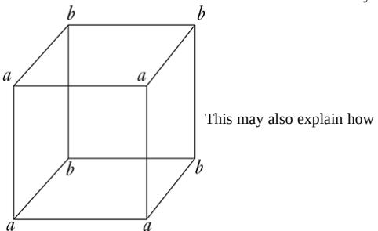
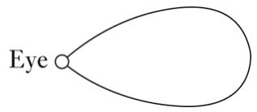
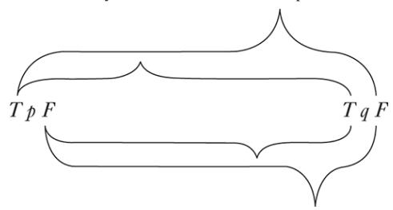
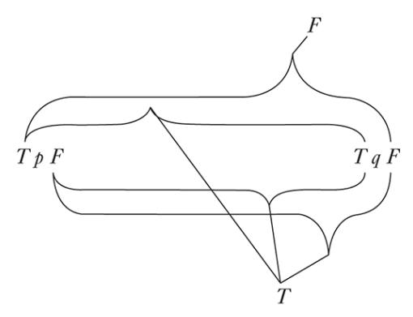
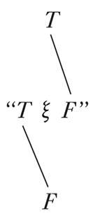
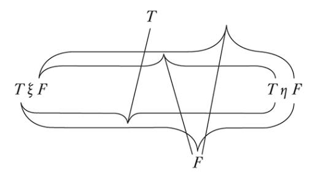
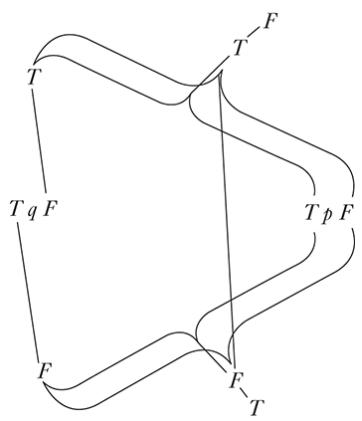
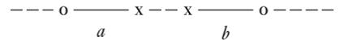

---
title: 维特根斯坦——逻辑哲学论
author: 路德维希·维特根斯坦
description: 素学研究
pubDate: 2025-11-20
tags: [Study,Philosophy,Linguistics]
categories: [Philosophy]
---

本书是路德维希·维特根斯坦生前唯一的出版物，罗素认为，它要解决的核心问题是：

> 语言与世界之间必须存在什么样的关系，才能使任何一个语词（无论它是什么）能够成为一个事实的符号？

罗素将《逻辑哲学论》视为一种形而上学理论，即它揭示了世界必须具有的某种逻辑结构。而维特根斯坦则认为，他是在澄清语言的逻辑语法，而不是在提出关于世界本体的理论。他展示的是“我们如何看世界”，而不是“世界本身是什么”。

维特根斯坦的大致思路是，澄清如何在语言中使用逻辑，阐释世界、语言、逻辑、思想和事态的关系，从中找到我们身处世界容器之中可以持有的某种世界观，讨论哪些可以说（自然科学、事实），哪些可以不言而明（逻辑形式），哪些不可言说（伦理、美学、生命的意义），并对不可言说之事要保持沉默，最后：

> 我的命题应当是以如下方式来起阐明作用的：任何理解我的人，当他应用这些命题作为梯子而爬过了它们之后，终于会认识到它们是没有任何意义的。（可以说，在登上高处之后，他必须把梯子扔掉。）

之所以用英译版本，是为了最大程度消解翻译本身增加的障碍（虽然不是德语）。

# TRACTATUS LOGICO-PHILOSOPHICUS

_Dedicated to the memory of my friend David H. Pinsent_

**Motto:** …and everything one knows, not merely heard as rumbling and roaring, can be said in three words. — Kürnberger\*

---

## PREFACE

This book will perhaps be understood only by someone who has already thought the thoughts expressed in it themselves—or at any rate similar thoughts. It is thus not a textbook. Its purpose would be achieved if it gave pleasure to one person who read it with understanding.

The book treats the problems of philosophy and shows—I believe—that the posing of these problems rests on misunderstanding the logic of our language. The whole sense of the book might be captured in these words: what can be said at all can be said clearly; and of what one cannot talk, about that one must be silent[.\\\*](#page-221-0)

The book thus aims to draw a limit to thinking, or rather, not to thinking but to the expression of thoughts: for to draw a limit to thinking, we would have to be able to think both sides of this limit (that is, we would have to be able to think what cannot be thought).

The limit will thus only be drawable in language and what lies on the other side of the limit will simply be nonsense.

How far my efforts coincide with those of other philosophers I have no wish to judge. What I have written here makes no claim at all to novelty in detail; and the reason I give no references is that I am not concerned with whether what I have thought has already been thought by someone else before me.

I only want to mention that I am indebted to the magnificent works of Frege and the writings of my friend Mr Bertrand Russell for a large part of the stimulation of my thoughts.

If this work has a value, then it consists in two things. First, in that thoughts are expressed in it, and this value will be greater the better the thoughts are expressed, the more the nail has been hit on the head.—Here I am conscious that I have fallen far short of what is possible, simply because my powers are too weak to accomplish the task.—May others come and do it better.

On the other hand it seems to me that the _truth_ of the thoughts conveyed here is unassailable and definitive. I am thus of the view that the problems in essence have been finally solved. And if I am not mistaken in this, then the value of this work consists, secondly, in showing how little is done when these problems are solved.

L.W.

_Vienna, 1918_

## 1 The world is everything that is the case

### 1.1 The world is the totality of facts, not of things.

#### 1.11 The world is determined by the facts and by their being _all_ the facts.

#### 1.12 For the totality of facts determines what is the case as well as everything that is not the case.

#### 1.13 The facts in logical space are the world.

### 1.2 The world divides into facts.

#### 1.21 Something can be the case or not the case and everything else remain the same.

## 2 What is the case, a fact, is the obtaining of states-of-things

#### 2.01 A state-of-things is a combination of objects (entities, things).[\\\*](#page-222-0)

##### 2.011 It is essential to a thing that it can be a constituent of a state-of-things.

##### 2.012 In logic nothing is accidental: if a thing _can_ occur in a state-of-things, then the possibility of the state-of-things must already be prefigured[\\\*](#page-222-1) in the thing.

###### 2.0121 It would appear as an accident, as it were, if a state of affairs were subsequently to fit a thing that could exist in and by itself.

If things can occur in states-of-things, then this possibility must already lie in them.

(What is logical cannot be merely possible. Logic deals with every possibility and all possibilities are its facts.)

Just as we cannot think of spatial objects at all outside space, or temporal objects outside time, so we cannot think of _any_ object outside the possibility of its combination with other objects.

If I can think of an object in the context of a state-ofthings, then I cannot think of it outside the _possibility_ of this context.

###### 2.0122 A thing is independent insofar as it can occur in all _possible_ states of affairs, but this form of independence is a form of connection with a state-of-things, a form of dependence. (It is impossible for words to appear in two different ways, on their own and in a proposition.[\\\*](#page-222-2))

###### 2.0123 If I kno[w\\\*](#page-223-0) an object, then I also know all the possibilities of its occurrence in states-of-things.

(Every such possibility must lie in the nature of the object.)

A new possibility cannot be found subsequently.

###### 2.01231 To know an object, I do not need to know its external properties—but I must know all its internal properties.

###### 2.0124 If all objects are given, then all _possible_ states-of-things are thereby also given.

##### 2.013 Every thing is, as it were, in a space of possible states-ofthings. I can think of this space as empty, but not of the thing without the space.

###### 2.0131 A spatial object must lie in infinite space. (A spatial point is an argument-place.)

A spot in the visual field need not be red, but it must have some colour: it has, so to speak, a colour space around it. A sound must have _some_ pitch, an object of touch _some_ hardness, and so on.

##### 2.014 Objects contain the possibility of all states of affairs[.\\\*](#page-223-1)

###### 2.0141 The possibility of its occurrence in states-of-things is the form of an object.

#### 2.02 An object is simple.[\\\*](#page-224-0)

###### 2.0201 Every statement about complexes can be analysed into a statement about their constituents and into those propositions that describe the complexes completely.

##### 2.021 Objects form the substance of the world. That is why they cannot be composite.

###### 2.0211 If the world had no substance, then whether a proposition

had sense would depend on whether another proposition was true.

###### 2.0212 It would then be impossible to draw up a picture of the world (true or false).

##### 2.022 It is obvious that an imagined world, however different from the real world it may be, must have something—a form—in common with the real world.

##### 2.023 This fixed form consists simply of the objects.

###### 2.0231 The substance of the world _can_ only determine a form and not any material properties. For these are only represented[\\\*](#page-224-1) by propositions—only formed by the configuration of objects.

###### 2.0232 Roughly speaking: objects are colourless.

###### 2.0233 Two objects of the same logical form—aside from their external properties—are only distinguished from one another in that they are different.

###### 2.02331 Either a thing has properties that nothing else has, in which case one can single it out from others straightaway by a description and refer to it;[\\\*](#page-225-0) or, instead, there are several things that have all their properties in common, in which case it is quite impossible to point to one of them.

For if a thing is not distinguished by anything, then I cannot distinguish it, for otherwise it would be distinguished.

##### 2.024 Substance is what subsist[s\\\*](#page-225-1) independently of what is the case.

##### 2.025 It is form and content.

###### 2.0251 Space, time and colour (colouration) are forms of objects.

##### 2.026 Only if there are objects can there be a fixed form of the world.

##### 2.027 The fixed, the subsisten[t\\\*](#page-225-2) and the object are one.

###### 2.0271 The object is the fixed, the subsistent; the configuration is the changing, the inconstant.[\\\*](#page-225-3)

###### 2.0272 The configuration of objects forms the state-of-things.

#### 2.03 In a state-of-things the objects hang in one another, like the links of a chain.

##### 2.031 In a state-of-things the objects stand to one another in a determinate way[.\\\*](#page-225-4)

##### 2.032 The way in which the objects connect[\\\*](#page-225-5) in a state-of-things is the structure of the state-of-things.

##### 2.033 The form is the possibility of the structure.

##### 2.034 The structure of the fact consists of the structures of the states-of-things.

#### 2.04 The totality of the obtaining states-of-things is the world.

#### 2.05 The totality of the obtaining states-of-things also determines which states-of-things do not obtain.

#### 2.06 The obtaining and non-obtaining of states-of-things is reality. (The obtaining of states-of-things we also call a positive, the non-obtaining a negative fact.)

##### 2.061 States-of-things are independent of one another.

##### 2.062 From the obtaining or non-obtaining of a state-of-things, the obtaining or non-obtaining of another cannot be inferred.

##### 2.063 The totality of reality is the world.

### 2.1 We picture facts.[\\\*](#page-225-6)

#### 2.11 A picture presents[\\\*](#page-225-7) a state of affairs in logical space, the obtaining and non-obtaining of states-of-things.

#### 2.12 A picture is a model of reality.

#### 2.13 In a picture, the elements of the picture correspond to the objects.

##### 2.131 In a picture, the elements of the picture stand for the objects.

#### 2.14 A picture consists in its elements standing to one another[\\\*](#page-226-0)

in a determinate way.

##### 2.141 A picture is a fact.

#### 2.15 That the elements of a picture stand to one another in a determinate way presents[\\\*](#page-226-1) that things stand to one another in this way.

This connection of the elements of a picture may be called its structure, and the possibility of this structure its form of depiction.

##### 2.151 The form of depiction is the possibility that things stand to one another in the same way as the elements of the picture do.

###### 2.1511 It is in _this_ way that a picture is connected[\\\*](#page-226-2) to reality; it reaches up to it.

###### 2.1512 It is laid against reality like a measure.

###### 2.15121 Only the outermost points of the dividing lines _touch_ the object to be measured.

###### 2.1513 On this conception, the depicting relation that makes it a picture thus also belongs to the picture.

###### 2.1514 The depicting relation consists of the correlations of the elements of the picture and the things.[\\\*](#page-226-3)

###### 2.1515 These correlations are, as it were, the feelers[\\\*](#page-226-4) of the picture's elements with which the picture touches reality.

#### 2.16 To be a picture, a fact must have something in common with what is depicted.

##### 2.161 There must be something identical in picture and depicted if the one is to be capable of being a picture of the other at all.

#### 2.17 What a picture must have in common with reality to be able to depict it in the way it does—correctly or incorrectly —is its form of depiction.

##### 2.171 A picture can depict any reality whose form it has. A spatial picture anything spatial, a coloured anything coloured, etc.

|     | 2.172 | A picture cannot depict, however, its form of depiction; it<br>features it.\*                                                                                                                       |
| --- | ----- | --------------------------------------------------------------------------------------------------------------------------------------------------------------------------------------------------- |
|     | 2.173 | A picture represents its object from outside (its standpoint<br>is<br>its<br>form<br>of<br>representation);<br>this<br>is<br>why<br>a<br>picture<br>represents its object correctly or incorrectly. |
|     | 2.174 | A picture cannot, however, place itself outside its form of<br>representation.                                                                                                                      |
|     | 2.18  | What any picture, of whatever form, must have in common<br>with reality to be able to depict it at all—correctly or<br>incorrectly—is logical form, that is, the form of reality.                   |
|     | 2.181 | If the form of depiction is logical form, then the picture is a<br>logical picture.                                                                                                                 |
|     | 2.182 | Every picture is<br>also<br>a logical picture. (On the other hand,<br>not every picture is a spatial picture, for example.)                                                                         |
|     | 2.19  | A logical picture can depict the world.                                                                                                                                                             |
| 2.2 |       | A picture has the logical form of depiction in common<br>with what is depicted.                                                                                                                     |
|     | 2.201 | A picture depicts reality by representing a possibility of the<br>obtaining and non-obtaining of states-of things.\*                                                                                |
|     | 2.202 | A picture represents a possible state of affairs in logical<br>space.                                                                                                                               |
|     | 2.203 | A picture contains the possibility of the state of affairs that<br>it represents.                                                                                                                   |
|     | 2.21  | A picture agrees with reality or not; it is correct or<br>incorrect, true or false.                                                                                                                 |
|     | 2.22  | A picture represents what it represents, independently of its<br>truth or falsity, through its form of depiction.                                                                                   |
|     | 2.221 | What a picture represents is its sense.                                                                                                                                                             |
|     | 2.222 | Its<br>truth<br>or<br>falsity<br>consists<br>in<br>the<br>agreement<br>or<br>disagreement of its sense with reality.                                                                                |
|     | 2.223 | To tell\*<br>whether<br>a picture is true or false, we must compare<br>it with reality.                                                                                                             |

|     | 2.224  | It is impossible to tell from the<br>picture alone whether it is<br>true or false.                                                                                                                                                                                                          |
| --- | ------ | ------------------------------------------------------------------------------------------------------------------------------------------------------------------------------------------------------------------------------------------------------------------------------------------- |
|     | 2.225  | No picture is true a priori.                                                                                                                                                                                                                                                                |
| 3   |        | A logical picture of facts is a thought.                                                                                                                                                                                                                                                    |
|     | 3.001  | 'A state-of-things is thinkable' means: we can picture it.\*                                                                                                                                                                                                                                |
|     | 3.01   | The totality of true thoughts is a picture of the world.                                                                                                                                                                                                                                    |
|     | 3.02   | A thought contains the possibility of the state of affairs that<br>is thought. What is thinkable is also possible.                                                                                                                                                                          |
|     | 3.03   | We cannot think anything illogical, since otherwise we<br>would have to think illogically.                                                                                                                                                                                                  |
|     | 3.031  | It was once said that God could create anything except<br>what was contrary to the laws of logic.—In truth, we could<br>not say of an 'illogical' world how it would look.                                                                                                                  |
|     | 3.032  | Something that 'contradicts logic' cannot be represented in<br>language<br>any<br>more<br>than,<br>in<br>geometry,<br>a<br>figure<br>that<br>contradicts the laws of space can be represented by its<br>coordinates, or the coordinates can be specified of a point<br>that does not exist. |
|     | 3.0321 | We can certainly represent a state-of-things spatially that<br>contravenes<br>the<br>laws<br>of<br>physics<br>but<br>not<br>one<br>that<br>contravenes the laws of geometry.                                                                                                                |
|     | 3.04   | An a<br>priori correct thought would be one whose possibility<br>ensured its truth.                                                                                                                                                                                                         |
|     | 3.05   | We could only know a priori that a thought is true if its<br>truth could be recognized from the thought itself (without<br>an object of comparison).                                                                                                                                        |
| 3.1 |        | In a proposition a thought is expressed perceptibly.\*                                                                                                                                                                                                                                      |
|     | 3.11   | We use the perceptible sign (sound or written sign, etc.) of<br>the proposition as a projection of a possible state of affairs.<br>The<br>method<br>of<br>projection<br>is<br>the<br>thinking<br>of<br>the<br>proposition's sense.                                                          |

#### 3.12 I call the sign by means of which we express a thought a

propositional sign. And a proposition is a propositional sign in its projective relation to the world[.\\\*](#page-227-1)

#### 3.13 To the proposition belongs everything that belongs to the projection, but not what is projected.

> Thus the possibility of what is projected, but not what is projected itself.

> In a proposition its sense is thus not yet contained, but it does contain the possibility of expressing it[.\\\*](#page-227-2)

> ('The content of a proposition' means the content of a senseful proposition.[\\\*](#page-228-0))

> In a proposition the form of its sense is contained, but not its content.

#### 3.14 A propositional sign consists in this, that its elements, the words, stand to one another in it in a determinate way.

A propositional sign is a fact.

##### 3.141 A proposition is not a mixture of words.—(Just as a musical theme is not a mixture of notes.)

A proposition is articulate.

##### 3.142 Only facts can express a sense, a set of names cannot.

##### 3.143 That a propositional sign is a fact is disguised by the ordinary—written or printed—form of expression.

For in a printed proposition, for example, a propositional sign does not look essentially different from a word.

(Thus it was possible for Frege to call a proposition a composite name.)

###### 3.1431 The essence of a propositional sign becomes very clear if we think of it as composed of spatial objects (such as tables, chairs, books) instead of written signs.The relative spatial position of these things then expresses the sense of the proposition.

###### 3.1432 Not: "The complex sign '_aRb_' says that a stands in the relation _R_ to _b_"; but: _That_ '_a_' stands in a certain relation to '_b_' says _that aRb_.

##### 3.144 States of affairs can be described, not _named_. (Names are like points, propositions are like arrows,

they have sense.)

### 3.2 In a proposition a thought can be so expressed that to the objects of the thought correspond elements of the propositional sign.

##### 3.201 I call these elements 'simple signs' and the proposition 'completely analysed'.

##### 3.202 The simple signs applied in the proposition are called names.

##### 3.203 A name means an object. The object is its meaning.[\\\*](#page-228-0) ('_A_' is the same sign as '_A_'.)

#### 3.21 The configuration of simple signs in a propositional sign corresponds to the configuration of objects in a state of affairs.

#### 3.22 A name in a proposition stands for an object.

##### 3.221 Objects I can only _name_. Signs stand for them. I can only speak _of_ them, I cannot _state them_[.\\\*](#page-228-1) A proposition can only say _how_ a thing is, not _what_ it is.

#### 3.23 The demand that simple signs be possible is the demand that sense be determinate[.\\\*](#page-228-2)

#### 3.24 A proposition about a complex stands in an internal relation to a proposition about one of its constituents.

A complex can only be given by its description, and this will be right or not right. A proposition that mentions a complex will not be nonsensical but simply false if the complex does not exist.

That a propositional element signifies a complex can be seen from an indeterminateness in the propositions in which it occurs. We _know_ that not everything is determined by any such proposition. (The generality-sign _contains_ a prototype[.\\\*](#page-228-3))

The contraction of a symbol for a complex into a simple symbol can be expressed by a definition.

#### 3.25 There is one and only one complete analysis of a proposition.

##### 3.251 A proposition expresses what it expresses in a determinate, clearly specifiable way: a proposition is articulate.

#### 3.26 A name cannot be dissected further by any definition: it is a primitive sign.

##### 3.261 Every defined sign signifies _via_ those signs by which it is defined; and the definitions point the way.

Two signs, one primitive sign and one defined by primitive signs, cannot signify in the same way. Names _cannot_ be unpacked[\\\*](#page-228-4) by definitions. (Nor any sign that has a meaning by itself, independently.)

##### 3.262 What does not get expressed in the signs, their application shows. What the signs hold back, their application spells out[.\\\*](#page-228-5)

##### 3.263 The meanings of primitive signs can be explained by elucidations. Elucidations are propositions that contain the primitive signs. They can therefore only be understood if the meanings of these signs are already known.

### 3.3 Only a proposition has sense; only in the context of a proposition does a name have meaning.[\\\*](#page-228-6)

#### 3.31 Every part of a proposition that characterizes its sense I call an expression (a symbol).

(The proposition itself is an expression.)

Expression is everything essential to the sense of a proposition that propositions can have in common with one another.

An expression marks a form and a content.

##### 3.311 An expression presupposes the forms of all propositions in which it can occur. It is the common characteristic mark of a class of propositions.

##### 3.312 It is thus represented by the general form of the propositions that it characterizes.

> That is to say, in this form the expression will be _constant_ and everything else _variable_.

##### 3.313 An expression is thus represented by a variable whose values are the propositions that contain the expression.

> (In the limiting case the variable becomes a constant, the expression a proposition.)

I call such a variable a 'propositional variable'.

##### 3.314 An expression only has meaning in a proposition. Every variable can be construed as a propositional variable.

(Even a variable name.)

##### 3.315 If we change a constituent of a proposition into a variable, then there is a class of propositions that are all the values of the resulting variable proposition. This class still depends in general on what we mean[,\\\*](#page-229-0) according to our arbitrary conventions, by parts of the original proposition. However, if we change into variables all those signs whose meaning was arbitrarily determined, then there is still such a class. But this is not now dependent on any convention, only on the nature of the proposition. It corresponds to a logical form—a logical prototype.

##### 3.316 What values a propositional variable may take is fixed. The fixing of the values _is_ the variable.[\\\*](#page-229-1)

##### 3.317 The fixing of the values of propositional variables is the _specification of the propositions_ whose common mark is the variable.

The fixing is a description of these propositions.

The fixing will thus be a matter only of symbols, not of their meaning.

And _only_ this is essential to the fixing, _that it is only a description of symbols and states nothing about what is signified_.

The way in which the propositions are described is inessential.

##### 3.318 I construe a proposition—like Frege and Russell—as a function of the expressions contained in it.

#### 3.32 A sign is what can be perceived of the symbol.

##### 3.321 Two different symbols can thus have a sign (written or spoken, etc.) in common with one another—they then signify in different ways.

##### 3.322 It can never indicate a common mark of two objects that we signify them by the same sign but through two different _modes of signification_. For the sign, of course, is arbitrary. Two different signs could just as well be chosen, and what would then remain of something common in the signification?

##### 3.323 In everyday language it occurs extremely often that the same word signifies in different ways—that is, belongs to different symbols—or that two words, which signify in different ways, are applied in a proposition in ostensibly the same way.

Thus the word 'is' appears as a copula, as an identity sign, and as an expression of existence;[\\\*](#page-229-2) 'exist' as an intransitive verb like 'go'; 'identical' as an adjective; we talk of _something_, but also say that _something_ happens.

(In the proposition 'Green is green'—where the first word is a person's name, the last an adjective—these words do not simply have different meaning but involve _different symbols_.)

##### 3.324 Thus the most fundamental confusions easily arise (of which the whole of philosophy is full).

##### 3.325 To avoid these errors, we must use a sign-language that excludes them, by not using the same sign in different symbols, and not using signs that signify in different ways in ostensibly the same way. A sign-language, that is, that obeys _logical_ grammar—logical syntax.

(Frege's and Russell's concept-script[\\\*](#page-229-3) is one such language, though it still fails to exclude all mistakes.)

##### 3.326 To recognize the symbol by its sign, one must pay attention to the senseful use[.\\\*](#page-229-4)

##### 3.327 A sign determines a logical form only together with its logical-syntactic use.

##### 3.328 If a sign is _not needed_, then it is meaningless. That is the point of Occam's razor[.\\\*](#page-229-5)

(If everything in the sign-language works as though a sign had meaning, then it does have meaning.[\\\*\)](#page-230-0)

#### 3.33 In logical syntax the meaning of a sign should never play a role; it must permit being drawn up without talk of the _meaning_ of a sign; it should presuppose _only_ the description of the expressions.

##### 3.331 This remark gives us insight into Russell's 'theory of types'[:\\\*](#page-230-1) Russell's error is shown in his having to talk of the meaning of signs in drawing up the rules for them.

##### 3.332 No proposition can state anything about itself, since a propositional sign cannot be contained in itself (that is all there is to the 'theory of types').

##### 3.333 That is why a function cannot be its own argument, since the function sign already contains the prototype of its argument and thus cannot contain itself.

For let us suppose that the function _F_( fx) could be its own argument; there would then be a proposition '_F_(_F_( fx))', and in this the outer function _F_ and the inner function _F_ must have different meanings, for the inner has the form _ϕ_( fx), the outer the form _ψ_(_ϕ_( fx)). The two functions only have in common the letter '_F_', but this by itself signifies nothing.

This becomes immediately clear if, instead of '_F_(_F_(_u_)', we write '(∃*ϕ*):_F_(_ϕ u_)_.ϕ u_=_Fu_'.

This resolves Russell's paradox.

##### 3.334 The rules of logical syntax must be self-explanatory[,\\\*](#page-230-2) once it is known how every single sign signifies.

#### 3.34 A proposition has essential and accidental features.

Accidental are the features that arise from the particular way that the propositional sign is generated. Essential are those that enable the proposition to express its sense.

##### 3.341 The essential in a proposition is thus what all propositions that can express the same sense have in common.

> And so too, in general, the essential in a symbol is what all symbols that can fulfil the same purpose have in common.

###### 3.3411 So one could say: the real name is what all symbols that can signify an object have in common. It would thus progressively turn out that no kind of composition is essential to a name[.\\\*](#page-230-3)

##### 3.342 In our notations there is indeed something arbitrary, but _this_ is not arbitrary: that _when_ we have determined something arbitrarily, then something else _must_ be the case. (This arises from the _essence_ of notation.)

###### 3.3421 A particular mode of signification may be unimportant, but it is always important that this is a _possible_ mode of signification. And this is how it is generally in philosophy: the particular proves time and again to be unimportant, but the possibility of each particular tells us something about the essence of the world.

##### 3.343 Definitions are rules for translating from one language into another. Every correct sign-language must be translatable into every other according to such rules: _this_ is what they all have in common.

##### 3.344 What signifies in a symbol is what is common to all those symbols by which it can be replaced according to the rules of logical syntax.

###### 3.3441 One can express, for example, what is common to all notations for truth-functions thus: they have in common that they can all _be replaced_—for example—by the notation that uses '~_p_' ('not-_p_') and '_p_ v _q_' ('_p_ or _q_').(This

typifies the way in which a specific possible notation can tell us something general.)

###### 3.3442 The sign for a complex, too, is not resolved arbitrarily in analysis, so that, say, its resolution might be different in every propositional structure.[\\\*](#page-230-4)

### 3.4 A proposition determines a place in logical space. The existence of this logical place is guaranteed by the existence of the constituents themselves, by the existence of the senseful proposition.

#### 3.41 The propositional sign and the logical coordinates: that is the logical place.

##### 3.411 A geometrical and a logical place accord in that both are the possibility of an existence.

#### 3.42 Although a proposition may determine only one place in logical space, nevertheless the whole of logical space must already be given by it.

(Otherwise, by means of negation, logical sum, logical product, etc., more and more new elements—in coordination—would be introduced.)

(The logical scaffolding around a picture determines the logical space. A proposition reaches through the whole of logical space.)

### 3.5 A propositional sign as applied in thinking is a thought. 4 A thought is a senseful proposition.

##### 4.001 The totality of propositions is language.

##### 4.002 Human beings possess the ability to construct languages in which every sense can be expressed, without having any idea of how and what each word means.—Just as one speaks without knowing how the individual sounds are produced.

Everyday language is a part of the human organism and no less complicated than it.

It is humanly impossible to immediately gather from it

the logic of language.

Language disguises thought. And in such a way that the form of the thought that is clothed cannot be inferred from the outer form of the clothing, because the outer form of the clothing is designed for quite other purposes than to allow the form of the body to be recognized.[\\\*](#page-230-5)

The tacit agreements underlying the understanding of everyday language are enormously complicated.

##### 4.003 Most of the propositions and questions that have been formulated about philosophical matters are not false but nonsensical. So we cannot answer questions of this kind at all, but only expose their nonsensicality. Most of philosophers' questions and propositions are due to our not understanding the logic of our language.

> (They are of the same kind as the question whether the good is more or less identical than the beautiful.)

> And it is no wonder that the deepest problems are really _not_ problems.

###### 4.0031 All philosophy is 'critique of language'. (Albeit not in Mauthner's sense[.\\\*\)](#page-230-6) Russell's merit is to have shown that the apparent logical form of a proposition need not be its real one.

#### 4.01 A proposition is a picture of reality.

A proposition is a model of reality as we conceive it.[\\\*](#page-231-0)

##### 4.011 At first sight a proposition—as printed out on paper, say does not appear to be a picture of the reality it concerns. But neither does musical notation appear at first sight to be a picture of music, nor our phonetic (alphabetic) notation a picture of our spoken language.

> And yet these sign-languages[\\\*](#page-231-1) prove to be pictures, even in the ordinary sense, of what they represent.

##### 4.012 It is obvious we have a sense of a proposition of the form '_aRb_' as a picture. Here the sign is obviously a likeness of what is signified.

##### 4.013 And if we penetrate to the essence of this pictoriality, then we see that this is _not_ confounded by _apparent irregularities_ (as in the use of ♯ and ♭ in musical notation).

> For these irregularities, too, depict what they are intended to express, just in a different way.

##### 4.014 A gramophone record, the musical thought, the musical notation, the sound waves, all stand to one another in that internal relation of depicting that holds between language and world.

Common to all of them is the logical construction.

(Like the two youths, their two horses and their lilies in the fairy tale.[\\\*](#page-231-2) They are all in a certain sense one.)

###### 4.0141 That there is a general rule by which the musician can read off the symphony from the score, and that there is a rule by which the symphony can be reconstructed from the line on the gramophone record and from this again—by means of the first rule—construct the score, is what constitutes the internal similarity between these apparently very different things. And this rule is the law of projection which projects the symphony into the language of the musical score. It is the rule for translating this language into the language of the gramophone record[.\\\*](#page-231-3)

##### 4.015 The possibility of all similes, of the whole pictoriality of our language,[\\\*](#page-231-4) lies in the logic of depiction.

##### 4.016 To understand the essence of a proposition, consider hieroglyphic script, which depicts the facts that it describes.

And alphabetic script came out of it, without losing what is essential in depiction.

#### 4.02 We see this from our ability to understand the sense of a propositional sign without its having been explained to us.

##### 4.021 A proposition is a picture of reality: for I know the state of affairs it represents if I understand the proposition. And I

understand the proposition without its sense having been explained to me.

##### 4.022 A proposition _shows_ its sense.

A proposition _shows_ how things stand _if_ it is true. And it _says that_ they so stand.[\\\*](#page-231-5)

##### 4.023 Reality must be fixed by a proposition to elicit either yes or no.[\\\*](#page-232-0)

> To do this, it must be completely described by the proposition.

A proposition is a description of a state-of-things.

Like the description of an object by its external properties, so a proposition describes reality by its internal properties.

A proposition constructs a world by means of a logical scaffolding and that is how one can actually see in the proposition all the logical features of reality _if_ it is true.[\\\*](#page-232-1) One can _draw inferences_ from a false proposition.

##### 4.024 To understand a proposition is to know what is the case if it is true.

> (One can thus understand it without knowing whether it is true.)

One understands it if one understands its constituents.

##### 4.025 The translation of one language into another does not proceed by translating every _proposition_ of one into a _proposition_ of another, but only the constituents of the proposition are translated.[\\\*](#page-232-2)

> (And the dictionary translates not only substantives but also verbs, adjectives, and conjunctions, etc.; and it treats them all alike.)

##### 4.026 The meanings of simple signs (words) must be explained to us for us to understand them.

With propositions, however, we communicate.[\\\*](#page-233-0)

##### 4.027 It is essential to a proposition that it can convey a _new_ sense to us.

#### 4.03 A proposition must convey a new sense with old expressions.

> A proposition conveys a state of affairs to us, and hence must connect _essentially_ to the state of affairs.

> And the connection is precisely that it is its logical picture.

> A proposition only states something insofar as it is a picture.

##### 4.031 In a proposition a state of affairs is put together experimentally, as it were.

> Saying that this proposition has such and such a sense is really saying that this proposition represents such and such a state of affairs.

###### 4.0311 One name stands for one thing, another for another thing, and they are combined with one another; in this way the whole—like a tableau vivant—presents a state-of-things.[\\\*](#page-233-0)

###### 4.0312 The possibility of a proposition rests on the principle of the representation of objects by signs.

My fundamental thought is that the 'logical constants' do not represent. That the _logic_ of facts cannot be represented[.\\\*](#page-233-1)

##### 4.032 A proposition is a picture of a state of affairs only insofar as it is logically articulated.

> (The proposition 'ambulo' is composite, too, since its stem with a different ending and its ending with a different stem yield different senses.)

#### 4.04 In a proposition there must be exactly as many things distinguishable as in the state of affairs it represents.

> The two must have the same logical (mathematical) multiplicity. (Compare Hertz's _Mechanics_, on Dynamic Models.[\)\\\*](#page-233-2)

##### 4.041 This mathematical multiplicity, of course, cannot in its turn be depicted. One cannot get outside it in depiction.

###### 4.0411 Trying to express, for example, what we express by '(_x_)._fx_'

by putting an index before '_fx_'—as in 'Gen._fx_'—wouldn't work: we would not know what was being generalized. Trying to register it by an index '_g_'—as in '_f_ (_x<sup>g</sup>_ )' wouldn't work either: we would not know the scope of the generality-sign.

Trying to do it by introducing a mark in the argumentplaces—as in '(_G_, _G_)._F_(_G_, _G_)'—wouldn't work: we could not determin[e\\\*](#page-233-3) the identity of the variables. And so on.

All these modes of signification do not work because they do not have the necessary mathematical multiplicity.

###### 4.0412 For the same reason the idealist's explanation of the seeing of spatial relations via 'spatial spectacles' doesn't work, because it cannot explain the multiplicity of these relations.

#### 4.05 Reality is compared with a proposition.

#### 4.06 A proposition can be true or false only by being a picture of reality.

##### 4.061 If one does not bear in mind that a proposition has a sense that is independent of the facts, then one can easily suppose that true and false are relations between sign and what is signified that are on an equal footing.

One could then say, for example, that '_p_' signifies in the true way what '~_p_' signifies in the false way, etc.

##### 4.062 Can't we communicate with false propositions as we have done up to now with true ones? So long as we know that they are meant to be false. No! For a proposition is true if things are as we say they are by using it; and if we mean ~_p_ by '_p_', and things are as we mean it, then '_p_' in the new conception is true and not false.

###### 4.0621 However, it is important that the signs '_p_' and '~_p_' _can_ say the same. For it shows that nothing in reality corresponds to the sign '~'.

The occurrence of negation in a proposition is not necessarily a mark of its sense (~~_p_ = _p_).

The propositions '_p_' and '~_p_' have opposite sense, but one and the same reality corresponds to them.

##### 4.063 A picture to explain the concept of truth: black spot on white paper; the form of the spot can be described by stating for each point of the surface whether it is white or black. The fact that a point is black corresponds to a positive fact, that a point is white (not black) to a negative fact. If I signify a point of the surface (a Fregean truthvalu[e\\\*\)](#page-233-4), then this corresponds to the supposition that is put up for judgement, etc. etc.

> However, to be able to say that a point is black or white, I must first know when a point is called black and when white; to be able to say that '_p_' is true (or false), I must have determined under what circumstances I call '_p_' true, and I thereby determine the sense of the proposition.

> The point at which the analogy breaks down is now this: we can indicate a point on the paper without even knowing what white and black are; but nothing at all corresponds to a proposition without sense, since it does not signify a thing (truth-value) whose properties are called, say, 'false' or 'true'; the verb of a proposition is not 'is true' or 'is false'—as Frege supposed—but that which is 'true' must already contain the verb.

##### 4.064 Every proposition must _already_ have sense; affirmation cannot give it sense, for what is affirmed is precisely its sense. And the same holds for negation, etc.

###### 4.0641 One could say: negation already relates to the logical place that the negated proposition determines.

The negating proposition determines a _different_ logical place than the negated does.

The negating proposition determines a logical place by means of the logical place of the negated proposition in describing the former as lying outside the latter.

That the negated proposition can again be negated alone

shows that what is negated is already a proposition and not just the preliminary to a proposition.

### 4.1 A proposition represents the obtaining and nonobtaining of states-of-things.

#### 4.11 The totality of true propositions is natural science in total (or the totality of the natural sciences).

##### 4.111 Philosophy is not one of the natural sciences.

(The word 'philosophy' must mean something that stands above or below, but not next to, the natural sciences.)

##### 4.112 The purpose of philosophy is the logical clarification of thoughts.

Philosophy is not a set of teachings[\\\*](#page-233-5) but an activity.

A philosophical work consists essentially of elucidations.

Philosophy results not in 'philosophical propositions' but in propositions becoming clear[.\\\*](#page-233-6)

Philosophy should make clear and delimit sharply thoughts that are otherwise, as it were, cloudy and blurred.

###### 4.1121 Psychology is no more akin to philosophy than is any other natural science.Theory of knowledge is the philosophy of psychology.Does not my study of sign-language correspond to the study of thought processes, which philosophers considered so essential to philosophy of logic? Only they usually got entangled in inessential psychological investigations, and there is an analogous danger as well with my method.

###### 4.1122 Darwinian theory has no more to do with philosophy than has any other hypothesis of natural science.

##### 4.113 Philosophy limits the disputable realm of natural science.

##### 4.114 It should delimit the thinkable and thereby the unthinkable. It should limit the unthinkable from within through the thinkable.[\\\*](#page-234-0)

##### 4.115 It will indicat[e\\\*](#page-235-0) the unsayable by clearly representing the

sayable.

##### 4.116 Everything that can be thought at all can be thought clearly. Everything that can be stated can be stated clearly[.\\\*](#page-235-1)

#### 4.12 A proposition can represent the whole of reality, but it cannot represent what it must have in common with reality to be able to represent it—the logical form.

To be able to represent the logical form, we would have to be able to position ourselves with a proposition outside logic, that is, outside the world.

##### 4.121 A proposition cannot represent the logical form; the logical form mirrors itself in the proposition.

> What mirrors itself in language, language cannot represent.

> What expresses _itself_ in language _we_ cannot express by means of language.

A proposition _shows_ the logical form of reality.

It features it.[\\\*](#page-235-2)

###### 4.1211 A proposition '_fa_' thus shows that the object _a_ occurs in its sense, two propositions '_fa_' and '_ga_' show that they are both about the same object.If two propositions contradict one another, then their structure shows this; likewise, if one follows from the other. And so on.

###### 4.1212 What _can_ be shown _cannot_ be said.

###### 4.1213 Now we understand, too, our feeling that we are in possession of a correct logical conception once everything is in order in our sign-language.

##### 4.122 We can talk in a certain sense of formal properties of objects and states-of-things, or of properties of the structure of facts, and in the same sense of formal relations and relations of structures.

(Instead of 'property of a structure' I also say 'internal property'; instead of 'relation of structures' 'internal relation'.

I introduce these expressions to show the ground of the

widespread confusion among philosophers between internal relations and real (external) relations.)

The obtaining of such internal properties and relations, however, cannot be asserted by means of propositions, but shows itself in the propositions that represent the relevant states-of-things and concern the relevant objects.

###### 4.1221 An internal property of a fact we can also call a feature of the fact. (In the sense in which we speak, say, of facial features.)

##### 4.123 A property is internal if it is unthinkable that its object does not have it.

(This blue colour and that one stand in the internal relation of lighter and darker eo ipso. It is unthinkable that _these_ two objects should not stand in this relation.)

(Here to the shifting use of the words 'property' and 'relation' there corresponds the shifting use of the word 'object'.)

##### 4.124 The obtaining of an internal property of a possible state of affairs is not expressed by a proposition, but expresses itself in the proposition that represents the state of affairs by an internal property of the proposition.

> It would be just as nonsensical to ascribe a formal property to a proposition as to deny its ascription.

###### 4.1241 Forms cannot be distinguished from one another by saying that one has this and another has that property, since this presupposes that it makes sense to predicate the two properties to the two forms.

##### 4.125 The obtaining of an internal relation between possible states of affairs expresses itself linguistically by an internal relation between the propositions that represent them.

###### 4.1251 This resolves the dispute 'whether all relations are internal or external'.

###### 4.1252 Series that are ordered by _internal_ relations I call formseries.

The number series is ordered not by an external but by an internal relation.

Just as in the series of propositions'_aRb_','(∃*x*):_aRx.xRb_','(∃*x*,_y_):_aRx.xRy.yRb_',and so forth.(If _b_ stands in one of these relations to _a_, then I call _b_ a successor of _a_.)

##### 4.126 In the sense in which we speak of formal properties, we can also talk of formal concepts.

> (I introduce this expression to make clear the ground of the confusion of formal concepts with real concepts, which pervades the whole of the old logic.)

> That something falls under a formal concept, as one of its objects, cannot be expressed by a proposition. Rather, it shows itself in the sign for the object itself. (A name shows that it signifies an object, a numerical sign that it signifies a number, etc.)

> Formal concepts, unlike real concepts,[\\\*](#page-235-3) cannot be represented by a function.

> For its marks, the formal properties, are not expressed by functions.

> The expression of a formal property is a feature of certain symbols.

> The sign of the marks of a formal concept is thus a characteristic feature of all symbols whose meanings fall under the concept.

> The expression of a formal concept is thus a propositional variable, in which only this characteristic feature is constant.

##### 4.127 The propositional variable signifies the formal concept, and its values signify the objects that fall under the concept.

###### 4.1271 Every variable is the sign of a formal concept.For every variable represents a constant form that all its values have, and which can be taken as a formal property of these values.

###### 4.1272 The variable name '_x_' is thus the real sign of the pseudo-

concep[t\\\*](#page-235-4) _object_.Wherever the word 'object' ('thing', 'entity', etc.) is correctly used, it is expressed in a conceptscript by a variable name.For example, in the proposition 'There are 2 objects which…' by '(∃*x*,_y_)…'.Wherever it is used differently, that is, as a real concept-word, nonsensical pseudo-propositions arise.So one cannot say, for example, 'There are objects' as one might say 'There are books'. Nor is 'There are 100 objects' or 'There are ℵ0 objects' any better.And it is nonsensical to speak of the _number of all objects_.The same applies to the words 'complex', 'fact', 'function', 'number', etc.They all signify formal concepts and are represented in a concept-script by variables, not by functions or classes (as Frege and Russell held).Expressions such as '1 is a number', 'there is only one zero' and the like are nonsensical.(It is just as nonsensical to say 'There is only one 1' as it would be to say '2 + 2 at 3 o'clock equals 4'.)

###### 4.12721 A formal concept is already given with an object that falls under it. So one cannot introduce as primitive ideas[\\\*](#page-235-5) the objects of a formal concept _and_ the formal concept itself. So one cannot, for example, introduce as primitive ideas the concept of a function as well as specific functions (as Russell does), or the concept of number and particular numbers.

###### 4.1273 If we want to express the general proposition '_b_ is a successor of _a_' in a concept-script, then we need for this an expression for the general term of the form-series:

$$aRb$$
, $(\exists x) : aRx.xRb$ , $(\exists x, y) : aRx.xRy.yRb$ , ...

The general term of a form-series can only be expressed by a variable, since the concept 'term of this form-series' is a _formal_ concept. (Frege and Russell overlooked this: the way in which they want to express general propositions such as the above is therefore false; it contains a vicious circle.)

We can determine the general term of a form-series by giving its first term and the general form of the operation that generates the next term from the preceding term.

###### 4.1274 The question as to the existence of a formal concept is nonsensical. For no proposition can answer such a question.

> (So, for example, one cannot ask: 'Are there unanalysable subject–predicate propositions?')

##### 4.128 Logical forms are number*less*.

That is why there are no pre-eminent numbers[\\\*](#page-235-6) in logic and why there is no philosophical monism or dualism, etc.

### 4.2 The sense of a proposition is its agreement and disagreement with the possibilities of the obtaining and non-obtaining of states-of-things.

#### 4.21 The simplest proposition, an elementary proposition, asserts the obtaining of a state-of-things.

##### 4.211 A sign of an elementary proposition is that no elementary proposition can contradict it.

#### 4.22 An elementary proposition consists of names. It is a connection, a concatenation, of names.

##### 4.221 It is obvious that, in the analysis of propositions, we must arrive at elementary propositions, which consist of names in immediate combination.

This raises the question as to how the propositional unity[\\\*](#page-236-0) comes about.

###### 4.2211 Even if the world is infinitely complex, so that every fact consists of infinitely many states-of-things and every stateof-things is composed of infinitely many objects, there must still be objects and states-of-things.

#### 4.23 A name occurs in a proposition only in the context[\\\*](#page-236-1) of an elementary proposition.

#### 4.24 Names are the simple symbols; I indicate them by single letters ('_x_', '_y_', '_z_').

I write an elementary proposition as a function of names in the form: '_fx_', '_ϕ_(_x_, _y_)', etc.

Or I indicate it by the letters _p_, _q_, _r_.

##### 4.241 If I use two signs with one and the same meaning, then I express this by placing the sign '=' between them.

> '_a_ = _b_' thus means[:\\\*](#page-236-2) the sign '_a_' is replaceable by the sign '_b_'.

> (If I introduce a new sign '_b_' by an equation, by stipulating that it may replace an already known sign '_a_', then (like Russell) I write the equation —definition—in the form '_a_ = _b_ Def.'. A definition is a rule for signs.)

##### 4.242 Expressions of the form '_a_ = _b_' are thus only representational aids; they state nothing about the meaning of the signs '_a_', '_b_'.

##### 4.243 Can we understand two names without knowing whether they signify the same thing or two different things?—Can we understand a proposition in which two names occur without knowing whether they mean the same or different things?

If I know, say, the meaning of an English word and a German word that means the same, then it is impossible for me not to know that they mean the same[;\\\*](#page-236-3) it is impossible that I cannot translate one into the other.

Expressions such as '_a_ = _a_', or ones derived from them, are neither elementary propositions nor any other kind of senseful signs. (This will be shown later.)

#### 4.25 If an elementary proposition is true, then the state-of-things obtains; if an elementary proposition is false, then the stateof-things does not obtain.

#### 4.26 The specification of all true elementary propositions describes the world completely. The world is completely described by the specification of all elementary propositions plus the specification as to which of them are true and which false.

#### 4.27 With regard to the obtaining and non-obtaining of n statesof-things there are possibilities.

> Any combination of states-of-things can obtain and the others not obtain.

#### 4.28 To these combinations correspond just as many possibilities of the truth—and falsity—of n elementary propositions.

### 4.3 The truth-possibilities of the elementary propositions mean the possibilities of the obtaining and nonobtaining of states-of-things.

#### 4.31 We can represent the truth-possibilities by schemata of the following kind ('T' means 'true', 'F' 'false'; the rows of 'T' and 'F' under the row of the elementary propositions mean their truth-possibilities, in easily understood symbolism):

| p   | q   | r   |
| --- | --- | --- |
| T   | T   | T   |
| F   | T   | T   |
| T   | F   | T   |
| T   | T   | F   |
| F   | F   | T   |
| F   | T   | F   |
| T   | F   | F   |
| F   | F   | F   |

| p   | q   |
| --- | --- |
| T   | T   |
| F   | T   |
| T   | F   |
| F   | F   |

| p   |     |
| --- | --- |
| T   |     |
| F   |     |

### 4.4 A proposition is the expression of agreement and disagreement with the truth-possibilities of the elementary propositions.

#### 4.41 The truth-possibilities of elementary propositions are the conditions of the truth and falsity of propositions.

##### 4.411 From the outse[t\\\*](#page-236-0) it is likely that the introduction of elementary propositions is fundamental to the understanding of all other kinds of proposition. Indeed, the understanding of general propositions depends _palpably_ on that of elementary propositions.

#### 4.42 With regard to the agreement and disagreement of a proposition with the truth-possibilities of n elementary propositions there are possibilities.

#### 4.43 We can express agreement with the truth-possibilities by correlating, say, the letter 'T' ('true') with them in the schema.

Absence of this letter means disagreement.

##### 4.431 The expression of the agreement and disagreement with the truth-possibilities of elementary propositions expresses the truth-conditions of a proposition.

A proposition is the expression of its truth-conditions.

(Frege was thus quite right in beginning with these in explaining the signs of his concept-script.[\\\*](#page-236-1) It is just that Frege's explanation of the concept of truth is incorrect: If 'the True' and 'the False' were really objects and the arguments in ~_p_ etc., then on Frege's account, the sense of '~_p_' would in no way be determined.)

#### 4.44 The sign that arises from correlating the letter 'T' with the truth-possibilities is a propositional sign.

##### 4.441 It is clear that no object (or complex of objects) corresponds to the complex of the signs 'F' and 'T', any more than to the horizontal and vertical lines or to brackets. —There are no 'logical objects'.

> This holds similarly, of course, for all signs that express the same as the schemata of 'T' and 'F'.

##### 4.442 This, for example, is a propositional sign:

| p   | q   |     |
| --- | --- | --- |
| T   | T   | T   |
| F   | T   | T   |
| T   | F   |     |
| F   | F   | T   |

(Frege's 'judgement stroke' '⊢' is logically quite meaningless; it only indicates for Frege (and Russell) that they hold the propositions so signified to be true.[\\\*](#page-237-0) '⊢' thus forms no part of propositional structure any more than does, say, a proposition's number. It is impossible for a proposition to state of itself that it is true.)

If the sequence of truth-possibilities in a schema is fixed once and for all by a rule of combination, then the last column by itself is an expression of the truth-conditions. If we write this column down as a row, then the propositional sign becomes: '(TT*T)(\_p*,_q_)' or better '(TTFT)(_p_,_q_)'.

(The number of places in the left-hand brackets is determined by the number of terms in the right-hand.)

#### 4.45 For _n_ elementary propositions there are _L<sup>n</sup>_ possible groups of truth-conditions.

> The groups of truth-conditions that pertain to the truthpossibilities of a number of elementary propositions can be ordered in a series.

#### 4.46 Among the possible groups of truth-conditions there are two extreme cases.

In one case the proposition is true for all the truthpossibilities of the elementary propositions. We say that the truth-conditions are _tautologous_.

In the second case the proposition is false for all the truth-possibilities: the truth-conditions are _contradictory_.

In the first case we call the proposition a tautology, in the second a contradiction.

##### 4.461 A proposition shows what it says, a tautology and a contradiction show that they say nothing.

> A tautology has no truth-conditions, since it is true unconditionally; and a contradiction is true on no condition.

Tautology and contradiction are senseless.

(Like a point from which two arrows diverge in opposite directions.)

(I know nothing about the weather, for example, when I know that it is raining or not raining.)

###### 4.4611 Tautology and contradiction, however, are not nonsensical; they are part of the symbolism, just like '0' is part of the symbolism of arithmetic.

##### 4.462 Tautology and contradiction are not pictures of reality. They do not represent any possible state of affairs. For the former allows _every_ possible state of affairs, the latter _none_.

In a tautology the conditions of agreement with the world—the representational relations—cancel one another out, so that it stands in no representational relation to reality.

##### 4.463 The truth-conditions determine the room that a proposition leaves to the facts.

> (A proposition, a picture, a model are, in a negative sense, like a solid body that restricts the freedom of movement of another; in a positive sense, like the space limited by solid substance in which a body finds a place.)

A tautology leaves open to reality the whole of—infinite

—logical space; a contradiction fills the whole of logical space and leaves no point open to reality. Neither of them can therefore determine reality in any way.

##### 4.464 The truth of tautology is certain, of propositions possible, of contradiction impossible.[\\\*](#page-237-1)

> (Certain, possible, impossible: here we have an indication of the gradation that we need in probability theory.)

##### 4.465 The logical product of a tautology and a proposition says the same as the proposition. This product is thus identical to the proposition. For the essence of a symbol cannot be altered without altering its sense.

##### 4.466 To a determinate logical combination of signs corresponds a determinate logical combination of their meanings; _every arbitrary_ combination only corresponds to uncombined signs.

That is, propositions that are true for every state of affairs cannot be combinations of signs at all, since, if they were, only determinate combinations of objects could correspond to them.

(And where there is no logical combination there is _no_ corresponding combination of objects.)

Tautology and contradiction are the limiting cases of the combination of symbols[,\\\*](#page-237-2) namely, their dissolution.

###### 4.4661 Admittedly, signs are combined with one another in tautology and contradiction as well, i.e. they stand in relations to one another, but these relations are meaningless, inessential to the _symbol_.

### 4.5 It now appears possible to specify the most general propositional form: that is, to give a description of the propositions of _any_ sign-language, so that every possible sense can be expressed by a symbol that fits the description, and that every symbol that fits the description can express a sense, if the meanings of the names are chosen accordingly.

It is clear that in the description of the most general propositional form _only_ what is essential to it may be described—since otherwise it would not be the most general.

That there is a general propositional form is demonstrated by this: that there cannot be a proposition whose form could not have been foreseen (i.e. constructed). The general form of a proposition is: such and such is the case.[\\\*](#page-237-3)

#### 4.51 Suppose that I am given _all_ elementary propositions; then the question arises as to what propositions I can form from them. And the answer is _all_ propositions and _this is how_ they are limited.

#### 4.52 Propositions are everything that follows from the totality of all elementary propositions (and also, of course, from its being the _totality of all_). (So, in a certain sense, one could say that _all_ propositions are generalizations of elementary propositions.)

#### 4.53 The general propositional form is a variable.

## 5 A proposition is a truth-function of elementary propositions.

> **(An elementary proposition is a truth-function of itself.)**

#### 5.01 Elementary propositions are the truth-arguments of propositions.

#### 5.02 It is easy to confuse the arguments of functions with the indices of names. For I recognize from both an argument and an index the meaning of the sign that contains them.

In Russell's '+_<sup>c</sup>_ ', for example, '_c_' is an index that indicates that the whole sign is the addition sign for cardinal numbers. But this designation rests on arbitrary convention and instead of '+_<sup>c</sup>_ ' a simple sign could be chosen; in '~_p_', however, '_p_' is not an index but an argument: the sense of '~_p_' _cannot_ be understood without

prior understanding of the sense of '_p_'. (In the name 'Julius Caesar' 'Julius' is an index. The index is always part of a description of the object to whose name we attach it. For example, _the_ Caesar of the gens Julia.)

The confusion of argument and index underlies, if I am not mistaken, Frege's theory of the meaning of propositions and functions. For Frege the propositions of logic were names and their arguments the indices of these names.

### 5.1 The truth-functions can be ordered in series. This is the foundation of probability theory.

##### 5.101 The truth-functions of any number of elementary propositions can be written down in a schema of the following kind:[\\\*](#page-237-4)

```
(TTTT) (p,q) Tautology (If p, then p; and if q, then q.)
[p⊃p. q⊃q]
(FTTT) (p,q) in words: Not both p and q. [~(p.q)]
(TFTT) (p,q) " " If q, then p. [q⊃p]
(TTFT) (p,q) " " If p, then q. [p⊃q]
(TTTF) (p,q) " " p or q. [pvq]
(FFTT) (p,q) " " Not q.[~ q]
(FTFT) (p,q) " " Not p. [~p]
(FTTF) (p,q) " " p or q, but not both. [p.~q: v : q.~p]
(TFFT) (p,q) " " If p, then q; and if q, then p. [p≡q]
(TFTF) (p,q) " " p
(TTFF) (p,q) " " q
(FFFT) (p,q) " " Neither p nor q. [~p.~q or p|q]
(FFTF) (p,q) " " p and not q. [p.~q]
(FTFF) (p,q) " " q and not p. [q.~p]
(TFFF) (p,q) " " p and q. [p.q]
(FFFF) (p,q) Contradiction (p and not p; and q and not q.)
[p.~p. q.~q]
```

Those truth-possibilities of its truth-arguments that make a proposition true I will call its _truth-grounds_.

#### 5.11 If the truth-grounds that are common to a number of propositions are all also truth-grounds of a particular proposition, then we say that the truth of this proposition follows from the truth of those propositions.

#### 5.12 In particular, the truth of a proposition '_p_' follows from the truth of another proposition '_q_' if all truth-grounds of the second are truth-grounds of the first.

##### 5.121 The truth-grounds of the one are contained in those of the other; _p_ follows from _q_.

##### 5.122 If _p_ follows from _q_, then the sense of '_p_' is contained in the sense of '_q_'.

##### 5.123 If a god creates a world in which certain propositions are true, then he thereby creates a world in which all their consequences are true as well. And similarly he could not create a world in which a proposition '_p_' is true without creating all its objects.

##### 5.124 A proposition affirms every proposition that follows from it.

###### 5.1241 '_p_._q_' is one of the propositions that affirm '_p_' and at the same time one of the propositions that affirm '_q_'.Two propositions are opposed to one another if there is no senseful proposition that affirms them both.Every proposition that contradicts another negates it.

#### 5.13 That the truth of one proposition follows from the truth of other propositions can be seen from the structure of the propositions.

##### 5.131 If the truth of one proposition follows from the truth of others, then this expresses itself through relations in which the forms of these propositions stand to one another; that is to say, we do not need to first put them in these relations by combining them with one another in one proposition;

rather, these relations are internal and obtain as soon as, and in virtue of, these propositions obtaining.

###### 5.1311 If we infer _q_ from _p_ v _q_ and ~_p_, then the relation between the propositional forms of '_p_ v _q_' and '~_p_' is here concealed by the mode of signification. But if we write, for example, '_p_|_q_.|._p_|_q_' instead of '_p_ v _q_' and '_p_|_p_' instead of '~_p_' (_p_|_q_ =neither _p_ nor _q_), then the inner connection becomes manifest.(That _fa_ can be inferred from (_x_)._fx_ shows that the generality is present also in the symbol '(_x_)._fx_'.)

##### 5.132 If _p_ follows from _q_, then I can take _q_ to infer _p_, deduce _p_ from _q_.

The kind of inference is to be gathered from the two propositions alone.

Only they themselves can justify the inference.

'Laws of inference', which are supposed—e.g. by Frege and Russell—to justify inferences, are senseless, and would be superfluous.

##### 5.133 All deduction proceeds a priori.

##### 5.134 From an elementary proposition no other can be deduced.

##### 5.135 In no way can an inference be drawn from the obtaining of any one state of affairs to the obtaining of another, completely different state of affairs.

##### 5.136 There is no causal nexus that would justify such an inference.

###### 5.1361 We _cannot_ infer future events from present ones.Superstition is the belief in the causal nexus.[\\\*](#page-238-0)

###### 5.1362 Freedom of the will consists in not yet being able to know future actions. We could only know them if causality were an _inner_ necessity, like that of logical inference.—The connection between knowledge and what is known is that of logical necessity.('_A_ knows that _p_ is the case' is senseless if _p_ is a tautology.)

###### 5.1363 If it does not _follow_ from a proposition's being self-evident

that it is true, then its self-evidence is no justification, either, for our belief in its truth.[\\\*](#page-238-1)

#### 5.14 If a proposition follows from another, then the latter says more than the former, the former less than the latter.

##### 5.141 If _p_ follows from _q_ and _q_ from _p_, then they are one and the same proposition.

##### 5.142 A tautology follows from all propositions: it says nothing.

##### 5.143 Contradiction is what is common to propositions that _no_ proposition has in common with another. Tautology is what is common to all propositions which have nothing in common with one another.

Contradiction vanishes, so to speak, outside, tautology inside all propositions.

Contradiction is the outer limit of propositions, tautology the empty point at their centre.[\\\*](#page-238-2)

#### 5.15 If _T<sup>r</sup>_ is the number of the truth-grounds of a proposition '_r_', _Trs_ the number of the truth-grounds of a proposition '_s_' that are also truth-grounds of '_r_', then we call the ratio _Trs:T<sup>r</sup>_ the measure of _probability_ that the proposition '_r_' gives to the proposition '_s_'.

##### 5.151 In a schema like that above in 5.101, let _T<sup>r</sup>_ be the number of the '_T_'s in the proposition _r_, _Trs_ the number of the '_T_'s in the proposition _s_ that are in the same columns as '_T_'s of the proposition _r_. The proposition _r_ then gives to the proposition _s_ the probability: _Trs:T<sup>r</sup>_ .

###### 5.1511 There is no special object that is peculiar to probability propositions.

##### 5.152 Propositions that have no truth-arguments in common with one another we call independent of one another.

Two elementary propositions give one another the probability ½.

If _p_ follows from _q_, then the proposition '_q_' gives to the proposition '_p_' the probability 1. The certainty of logical

inference is a limiting case of probability.

(Application to tautology and contradiction.)

##### 5.153 A proposition is in itself neither probable nor improbable. An event occurs or it does not occur; there is no middle case.

##### 5.154 Suppose that in an urn there are just as many white as black balls (and no others). I draw one ball after another and put them back again in the urn. I can then establish by experiment that the numbers of drawn black and white balls converge as the draw continues.

_This_ is therefore not a mathematical factum.[\\\*](#page-238-0)

If I now say, 'It is equally probable that I will draw a white as a black ball', then this is to say, 'All the circumstances known to me (including the laws of nature hypothetically assumed) give to the occurrence of the one event no _more_ probability than to the occurrence of the other'. That is, they give to each—as is easily gathered from the explanations above—the probability ½.

What I confirm by the experiment is that the occurrence of the two events is independent of the circumstances of which I know nothing further.

##### 5.155 The unit of a probability proposition is this: the circumstances—of which I know nothing more—give to the occurrence of a definite event such and such a degree of probability.

##### 5.156 Probability is thus a generalization.

It involves a general description of a propositional form.

Only when certainty is lacking do we use probability.— That is, when we do not fully know a fact, but do know _something_ about its form.

(A proposition can indeed be an incomplete picture of a certain state of affairs, but it is always a complete picture.)

A probability proposition is, as it were, an extract[\\\*](#page-238-1) from other propositions.

## **relations to one another.**

#### 5.21 We can bring out these internal relations in our mode of expression, by representing a proposition as the result of an operation that generates it from other propositions (the bases of the operation).

#### 5.22 An operation is the expression of a relation between the structures of its result and its bases.

#### 5.23 An operation is what must happen to a proposition to make another out of it.

##### 5.231 And that will depend, of course, on their formal properties, on the internal similarity of their forms.

##### 5.232 The internal relation that orders a series is equivalent to the operation that generates one term from another.

##### 5.233 An operation can only arise where a proposition is generated from another in a logically significant way; that is, where the logical construction of the proposition begins.

##### 5.234 Truth-functions of elementary propositions are results of operations that have the elementary propositions as bases. (I call these operations truth-operations.)

###### 5.2341 The sense of a truth-function of _p_ is a function of the sense of _p_.Negation, logical addition, logical multiplication, etc., etc., are operations.(Negation reverses the sense of a proposition.)

#### 5.24 An operation shows itself in a variable; it shows how one can get from one form of proposition to another.

It gives expression to the difference between the forms. (And what is common to the bases and the result of the operation is precisely the bases.)

##### 5.241 An operation does not mark a form but only the difference between forms.

##### 5.242 The same operation that generates '_q_' from '_p_' also generates '_r_' from '_q_', and so forth. This can only be

expressed by '_p_', '_q_', '_r_', etc. being variables that give expression in a general way to certain formal relations.

#### 5.25 The occurrence of an operation does not characterize the sense of a proposition.

> For nothing is stated by the operation, only by its result, and this depends on the bases of the operation.

> (Operation and function must not be confused with one another.)

##### 5.251 A function cannot be its own argument, but the result of an operation can certainly become its own base.

##### 5.252 Only in this way is the progression possible from term to term in a form-series (from type to type in Russell and Whitehead's hierarchies). (Russell and Whitehead did not admit the possibility of this progression, but made use of it again and again.)

###### 5.2521 The repeated application of an operation to its own result I call its successive application ('_O_'_O_'_O_'_a_' is the result of three successive applications of '_O_'_ξ_' to '_a_').In a similar sense I talk of the successive application of _several_ operations to a number of propositions.

###### 5.2522 The general term of a form-series _a_, _O_'_a_, _O_'_O_'_a_,…I thus write as follows: '[*a*, *x*, *O*'*x*]'. This bracketed expression is a variable. The first term of the bracketed expression is the beginning of the form-series, the second the form of an arbitrary term _x_ of the series, and the third the form of the term of the series that immediately follows _x_.

###### 5.2523 The concept of the successive application of an operation is equivalent to the concept 'and so on'.

##### 5.253 An operation can reverse the effect of another. Operations can cancel one another.

##### 5.254 An operation can vanish (for example, negation in '~~_p_'; ~~_p_ = _p_).

### 5.3 All propositions are results of truth-operations on elementary propositions.

A truth-operation is the way in which a truthfunction arises from elementary propositions.

It is of the essence of a truth-operation that, in the same way as elementary propositions give rise to their truth-function, truth-functions give rise to a new one. Every truth-operation generates, from truth-functions of elementary propositions, another truth-function of elementary propositions, a proposition. The result of every truth-operation on the results of truth-operations on elementary propositions is also the result of _one_ truth-operation on elementary propositions.

Every proposition is the result of truth-operations on elementary propositions.

#### 5.31 The schemata in 4.31 also have a meaning, then, when '_p_', '_q_', '_r_', etc. are not elementary propositions.

> And it is easy to see that the propositional sign in 4.442 expresses one truth-function of elementary propositions even when '_p_' and '_q_' are truth-functions of elementary propositions.

#### 5.32 All truth-functions are results of the successive application of a finite number of truth-operations to elementary propositions.

### 5.4 This shows that there are no 'logical objects', no 'logical constants' (in Frege's and Russell's sense).

#### 5.41 For all results of truth-operations on truth-functions are identical whenever they are one and the same truthfunction of elementary propositions.

#### 5.42 That v, ⊃, etc. are not relations in the sense of right and left, etc., is evident.

The interdefinability of Frege's and Russell's 'primitive signs' of logic shows in itself that these are not primitive signs and, even more, that they do not signify relations.

And it is obvious that the '⊃' that we define by means of '~' and 'v' is identical with the one by means of which,

with '~', we define 'v', and that this 'v' is identical with the first; and so on.

#### 5.43 It is surely hard to believe[\\\*](#page-238-2) that from one fact _p_ infinitely many _others_ should follow, namely, ~~_p_, ~~~~_p_, etc. And no less remarkable is it that the infinite number of propositions of logic (mathematics) follow from half a dozen 'primitive propositions'.[\\\*](#page-239-0)

> All propositions of logic, however, say the same. Namely, nothing.

#### 5.44 Truth-functions are not material functions.

If an affirmation, for example, can be generated by double negation, then is negation—in some sense contained in affirmation? Does '~~_p_' negate ~_p_, or does it affirm _p_, or both?

The proposition '~~_p_' is not concerned with negation as if it were an object; but the possibility of negation is certainly already presupposed in affirmation.

And if there were an object called '~', then what '~~_p_' and '_p_' say would have to be different. For the one proposition would then be concerned with ~, the other not.

##### 5.441 This vanishing of the apparent logical constants also occurs where '~(∃*x*).~_fx_' says the same as '(_x_)._fx_', or '(∃*x*). _fx_._x_ = _a_' the same as '_fa_'.

##### 5.442 If a proposition is given to us, then _with it_ are also given the results of all truth-operations that have it as their base.

#### 5.45 If there are primitive signs of logic, then a correct logic must make clear their relation to one another and justify their occurrence[.\\\*](#page-239-1) The construction of logic _out of_ its primitive signs must become clear.

##### 5.451 If logic has primitive ideas, then they must be independent of one another. If a primitive idea is introduced, then it must be introduced in all combinations in which it occurs whatsoever. It cannot be introduced, that is, first for _one_ combination and then once more for another. For example,

if negation is introduced, then it must now be the case that we understand it in propositions of the form '~_p_' as well as in propositions such as '~(*p*v*q*)', '(∃*x*).~_fx_', among others. We must not introduce it first for one class of cases, then for another, for it would then be left in doubt whether its meaning is the same in the two cases and there would be no reason given for using the same kind of sign-combination in the two cases.

(In short, what Frege said (in _Basic Laws of Arithmetic_) about the introduction of signs by means of definitions also holds, mutatis mutandis, for the introduction of primitive signs[.\\\*\)](#page-239-2)

##### 5.452 The introduction of a new aid into the symbolism of logic must always be an event of consequence. No new aid may be introduced in logic—with a quite innocent face, so to speak—in brackets or in the margins.

> (This is how definitions and primitive propositions appear in words in Russell and Whitehead's _Principia Mathematica_[.\\\*](#page-239-3) Why suddenly words here? Justification is needed. This is missing and is bound to be missing, since the practice is in fact illegitimate.)

> If the introduction of a new aid has proved necessary at a certain point, however, then the question must immediately be asked: Where must this aid now _always_ be applied? Its place in logic must now be explained.

##### 5.453 All numbers in logic have to be justified.

Or rather: it must turn out that there are no numbers in logic.

There are no pre-eminent numbers.[\\\*](#page-239-4)

##### 5.454 In logic there is no juxtaposition,[\\\*](#page-239-5) there can be no classification.

> In logic there cannot be degrees of generality and specificity.

###### 5.4541 The solutions of the problems of logic must be simple, for they set the standard of simplicity.People have always

suspected that there must be a realm of questions whose answers—a priori—lie symmetrically united in a selfcontained, regular structure.A realm in which the proposition holds: simplex sigillum veri.[\\\*](#page-239-6)

#### 5.46 If the logical signs were introduced correctly, then the sense of all their combinations would thereby also have been introduced; that is, not only '*p*v*q*' but also '~(*p*v~_q_)', etc. etc. The effect of all possible combinations of brackets would thereby also have been introduced. And it would then have become clear that the real general primitive signs are not '*p*v*q*', '(∃*x*)._fx_', etc., but the most general form of their combinations.

##### 5.461 Of great significance is the apparently unimportant fact that pseudo-relations in logic, such as v und ⊃, need brackets, unlike real relations.

> For the use of brackets with these apparently primitive signs already indicates that they are not the real primitive signs. And no one could possibly believe that brackets have an independent meaning.

###### 5.4611 Signs for logical operations are punctuation marks.

#### 5.47 It is clear that everything that can be said _from the outset_ about the form of all propositions must be capable of being said _all at once_.

> For all logical operations are already contained in the elementary proposition. For '_fa_' says the same as '(∃*x*)._fx.x_ = _a_'.

> Where there is compositionality, there is argument and function, and where these are, there are already all logical constants.

> One could say: the one logical constant is what _all_ propositions, by their nature, have in common with one another.

But that is the general propositional form.

##### 5.471 The general propositional form is the essence of the proposition.

###### 5.4711 To specify the essence of the proposition is to specify the essence of all description, and thus the essence of the world.

##### 5.472 The description of the most general propositional form is the description of the one and only general primitive sign in logic.

##### 5.473 Logic must take care of itself.

A _possible_ sign must also be able to signify. Everything that is possible in logic is also permitted. ('Socrates is identical' thus means nothing, because there is no property that is called 'identical'. The proposition is nonsensical because we have failed to make some arbitrary determination, not because the symbol in itself is impermissible.)

In a certain sense, we cannot make mistakes in logic.

###### 5.4731 Self-evidence, of which Russell spoke so much, can only become dispensable in logic by language itself preventing every logical mistake.—That logic is a priori consists in this: that we _cannot_ think illogically.

###### 5.4732 We cannot give a sign the wrong sense.

###### 5.47321 Occam's razor is not, of course, an arbitrary rule, nor one justified by its practical success: it says that _unnecessary_ sign-units mean nothing.Signs that serve _one_ purpose are logically equivalent, signs that serve _no_ purpose are logically meaningless.

###### 5.4733 Frege says: every legitimately constructe[d\\\*](#page-239-7) proposition must have a sense; and I say: every possible proposition is legitimately constructed, and if it has no sense, then this can only be because we have not given a _meaning_ to some of its constituents.(Even if we think we have done so.)So that is why 'Socrates is identical' says nothing, because we have given _no_ meaning to the word 'identical' as _adjective_. For when it occurs as the identity sign, it symbolizes in a quite different way—the signifying relation is a different

one; that is, the symbol in the two cases is also quite different; the two symbols have only the sign in common with one another accidentally.

##### 5.474 The number of basic operations that are required depends _only_ on our notation.

##### 5.475 It is simply a matter of constructing a sign-system with a particular number of dimensions—with a particular mathematical multiplicity.

##### 5.476 It is clear that the concern here is not with a _number of primitive ideas_ that have to be signified, but with the expression of a rule.

### 5.5 Every truth-function is a result of the successive application of the operation (– – – – – T)(\*ξ\*,….) to elementary propositions.

> **This operation negates each and every proposition in the right-hand brackets and I call it the negation of these propositions.**

##### 5.501 I indicate a bracket-expression whose terms are propositions—where the order of the terms is irrelevant by a sign of the form '( )'. '_ξ_' is a variable whose values are the terms of the bracket-expression, and the line over the variable indicates that it stands for all its values in the brackets.

> (If _ξ_ thus has, say, the 3 values, _P_, _Q_, _R_, then ( ) = (_P_, _Q_, _R_).)

The values of the variables are fixed.

The fixing[\\\*](#page-239-8) is a description of the propositions that the variable stands for.

How the description of the terms of the bracketexpression is given is inessential.

We _can_ distinguish three kinds of description: 1. Direct enumeration. In this case we can simply replace the variable by its constant values. 2. Specification of a function _fx_, whose values for all values of _x_ are the

propositions to be described. 3. Specification of a formal law according to which the propositions are constructed. In this case the terms of the bracket-expression are all the terms of a form-series.

##### 5.502 Instead of '(– – – T)(_ξ_,….)' I thus write '(_N_( )'.

- _N_( ) is the negation of all the values of the propositional variable _ξ_.

##### 5.503 Since it is obviously easy to express how propositions can be, or are not to be, constructed by this operation, this must also be capable of finding exact expression.

#### 5.51 If _ξ_ has only one value, then _N_( ) = ~_p_ (not _p_); if it has two values, then _N_( ) = ~_p_.~_q_ (neither _p_ nor _q_).

##### 5.511 How can logic, all-encompassing and mirroring the world, use such specific hooks and manipulations?[\\\*](#page-239-9) Only by their all connecting into an infinitely fine network, to the great mirror.

##### 5.512 '~_p_' is true if '_p_' is false. In the true proposition '~_p_', then, '_p_' is a false proposition. So how is it that the stroke '~' brings it into agreement with reality?

What negates in '~_p_', however, is not the '~' but what is in common to all signs of this notation that negate _p_.

That is, the common rule according to which '~_p_', '~~~_p_'. '~*p*v~_p_'. '~_p_.~_p_', etc. etc. (ad infinitum) are constructed. And it is what is common here that mirrors negation.

##### 5.513 One could say: what is common to all symbols that affirm both _p_ and _q_ is the proposition '_p_._q_'. What is common to all symbols that affirm either _p_ or _q_ is the proposition '_p_ v _q_'.

> So, too, one can say: two propositions are opposed to one another if they have nothing in common with one another; and: every proposition has only one negative, since there is only one proposition that lies wholly outside it.

This shows itself also in Russell's notation: that '_q_: _p_ v~ _p_' says the same as '_q_'; that '_p_ v ~_p_' says nothing.

##### 5.514 If a notation is established, then there is in it a rule according to which all propositions negating _p_ are constructed, a rule according to which all propositions affirming _p_ are constructed, a rule according to which all propositions affirming _p_ or _q_ are constructed, and so on. These rules are equivalent to the symbols and in them their sense is mirrored.

##### 5.515 It must show itself in our symbols that what is combined with one another by 'v', '.', etc., must be propositions.

And this is indeed the case, since the symbol '_p_' and '_q_' itself presupposes 'v', '~', etc. If the sign '_p_' in '_p_ v _q_' does not stand for a complex sign, then it cannot have sense by itself; but then the signs '_p_ v _p_', '_p_._p_', etc., which have the same sense as '_p_', can have no sense either. But if '_p_ v _p_' has no sense, then neither can '_p_ v _q_' have sense.

###### 5.5151 Must the sign of a negative proposition be constructed with the sign of the positive? Why should one not be able to express a negative proposition by means of a negative fact? (For example, if '_a_' does not stand in a particular relation to '_b_', then this could express that _aRb_ is not the case.)But even here the negative proposition is constructed indirectly by means of the positive.The positive _proposition_ must presuppose the existence of the negative _proposition_, and conversely.

#### 5.52 If the values of _ξ_ are all the values of a function _fx_ for all values of _x_, then N( ) = ~(∃x)._fx_.

##### 5.521 I separate the concept _all_ from the truth-function[.\\\*](#page-239-0)

Frege and Russell introduced generality in connection with logical product or logical sum. It thus became hard to understand the propositions '(∃*x*)._fx_' and '(_x_)._fx_', in which both ideas are incorporated.

##### 5.522 The peculiarity of the generality-sign is, first, that it points

to a logical prototype, and second, that it highlights constants.

##### 5.523 The generality-sign occurs as an argument.

##### 5.524 If objects are given, then _all_ objects are thereby also given to us.

If elementary propositions are given, then _all_ elementary propositions are thereby also given.

##### 5.525 It is incorrect to paraphrase the proposition '(∃*x*)._fx_' as '_fx_ is _possible_', as Russell does.

> The certainty, possibility, or impossibility of a state of affairs is not expressed by a proposition but by an expression's being a tautology, a senseful proposition, or a contradiction.

> That precedent to which one invariably wants to appeal must already lie in the symbol itself.

##### 5.526 One can describe the world completely by fully generalized propositions, that is, without correlating from the outset any name with a particular object.

> To then arrive at the usual mode of expression, one simply has to say, after an expression 'there is one and only one _x_ that…', and this _x_ is _a_.

###### 5.5261 A fully generalized proposition is composite like every other proposition. (This is shown in our having to mention '_ϕ_' and '_x_' separately in '(∃*x*, _ϕ_)._ϕx_'. Both stand independently in signifying relations to the world as in an ungeneralized proposition.)

> A mark of a composite symbol: it has something in common with _other_ symbols.

###### 5.5262 The truth or falsity of _every_ proposition alters something in the general construction of the world. And the scope that is left open to its construction by the totality of elementary propositions is precisely that which the quite general propositions limit.(If an elementary proposition is true,

- then, at any rate, one _more_ elementary proposition is thereby true.)

#### 5.53 Identity of object I express by identity of sign and not by means of an identity sign[.\\\*](#page-239-1) Difference of objects by difference of signs.

###### 5.5301 That identity is not a relation between objects is selfevident. This becomes very clear if one considers, for example, the proposition '(_x_): _fx_. ⊃. _x_ = _a_'. What this proposition says is simply that _only a_ satisfies the function _f_, and not that only such things that have a certain relation to a satisfy the function _f_.Of course, one could say that it is _only_ a that has this relation to _a_, but in order to express this, we would need the identity sign itself.

###### 5.5302 Russell's definition of '=' doesn't work, because according to it one cannot say that two objects have all their properties in common. (Even if this proposition is never correct, it still has _sense_.)

###### 5.5303 Roughly speaking: to say of _two_ things that they are identical is nonsense, and to say of _one_ thing that it is identical with itself says nothing at all.

##### 5.531 I thus write not '_f_ (_a_,_b_). _a_ = _b_' but '_f_ (_a_,_a_)' (or '_f_ (_b_,_b_)'). And not '_f_ (_a_,_b_). ~_a_ = _b_' but '_f_ (_a_,_b_)'.

##### 5.532 And analogously: Not '(∃*x*,_y_). _f_ (_x_,_y_). _x_ = _y_', but '(∃*x*). _f_ (_x_,_x_)'; and not '(∃*x*,_y_). _f_ (_x_,_y_). ~_x_ = _y_', but '(∃*x*,_y_). _f_ (_x_,_y_)'. (So instead of Russell's '(∃*x*,_y_). _f_ (_x_,_y_)': '(∃*x*,_y_). _f_ (_x_,_y_). v. (∃*x*). _f_ (_x_,_x_)'.)

###### 5.5321 Instead of '(_x_): _fx_. ⊃. _x_ = _a_' we thus write, for example, '(∃*x*). _fx_. ⊃. _fa_: ~(∃*x*,_y_). _fx_. _fy_'.And the proposition '_only_ one _x_ satisfies _f_ ( )' reads: '(∃*x*). _fx_: ~(∃*x*,_y_). _fx_. _fy_'.

##### 5.533 The identity sign is thus not an essential constituent of a concept-script.

##### 5.534 And now we see that pseudo-propositions such as '_a_ = _a_', '_a_ = _b_ . _b_ = _c_. ⊃. a = _c_', '(_x_). _x_ = _x_', '(∃*x*). _x_ = _a_', etc.,

cannot even be written down in a correct concept-script.

##### 5.535 This also resolves all the problems that were connected with such pseudo-propositions.

> All the problems that Russell's 'axiom of infinity' raises can already be solved here.

> What the axiom of infinity tries to say would express itself in language by there being infinitely many names with a different meaning.

###### 5.5351 There are certain cases in which one is tempted to use expressions of the form '_a_ = _a_' or '*p*⊃*p*' and the like. And indeed this happens when one wants to talk of a prototype —of proposition, thing, etc. Thus Russell, in _The Principles of Mathematics_, had rendered the nonsense '_p_ is a proposition' in symbols as '*p*⊃*p*' and placed it as hypothesis before certain propositions so that their argument-places could only be filled by propositions[.\\\*](#page-240-0)(It is nonsense, from the start, to place the hypothesis *p*⊃*p* before a proposition to ensure that its arguments have the correct form, because the hypothesis for a non-proposition as argument becomes not false but nonsensical, and because the proposition itself becomes nonsensical by the incorrect kind of argument—in other words, it protects itself from incorrect arguments just as well, or poorly, as attaching a senseless hypothesis for this purpose.)

###### 5.5352 Likewise one has tried to express 'There are no _things_' by '~(∃*x*). _x_ = _x_'. But even if this were a proposition, would it not be true as well if indeed 'there were things' but these were not identical with themselves?

#### 5.54 In the general propositional form a proposition occurs in a proposition only as the base of truth-operations.

##### 5.541 At first sight it looks as if a proposition could occur in another in a different way as well.

Especially in certain propositional forms in psychology, such as '_A_ believes that _p_ is the case' or '_A_ thinks _p_', etc.

That is, superficially, it looks here as if the proposition _p_

stood in a kind of relation to an object _A_.

(And in modern epistemology (Russell, Moore, etc.) these propositions have been construed in just this way.)

##### 5.542 It is clear, however, that '_A_ believes that _p_', '_A_ thinks _p_', '_A_ says _p_' are of the form '"_p_" says _p_': and this does not concern a correlation of a fact with an object, but the correlation of facts by means of a correlation of their objects.

###### 5.5421 This also shows that there is no such thing as the soul—the subject, etc.—as construed in the superficial psychology of today.A composite soul, that is, would no longer be a soul.

###### 5.5422 The correct explanation of the form of the proposition '_A_ judges _p_' must show that it is impossible to judge nonsense. (Russell's theory does not satisfy this condition.)

###### 5.5423 To perceive a complex is to perceive that its constituents stand to one another in such and such a way.



the figurecan be seen as a cube in two ways, and all similar appearances. For we really do see two different facts.(If I look first at the _a_ corners and only fleetingly at the _b_ ones, then the _a_ corners appear in front, and conversely.)

#### 5.55 We must now answer a priori the question as to all possible forms of elementary propositions.

An elementary proposition consists of names. Since we cannot specify the number of names with different meaning, however, we cannot specify the composition of the elementary proposition either.

##### 5.551 Our basic principle is that every question that can be decided at all by logic must be capable of being decided straightaway.

> (And if we find ourselves having to answer such a problem by looking at the world, then this shows that we are on the wrong track altogether.)

##### 5.552 The 'experience' that we need to understand logic is not that such and such is the case,[\\\*](#page-240-1) but that something _is_; that, however, is precisely _not_ an experience.

> Logic is _prior_ to every experience—that something is _so_.

It is prior to the how, not prior to the what.

###### 5.5521 And if this were not so, then how could we apply logic? One could say: if there were a logic even if there were no world, then how could there be a logic given that there is a world?

##### 5.553 Russell said that there were simple relations between different numbers of things (individuals). But between what numbers? And how is that to be decided?—By experience?

(There is no pre-eminent number[.\\\*\)](#page-240-2)

##### 5.554 The specification of any particular form would be completely arbitrary.

###### 5.5541 It is supposed to be specifiable a priori whether, for example, I can get into a position where I have to signify something with a sign for a 27-place relation.

###### 5.5542 But may we even ask this? Can we establish a sign form and not know whether something can correspond to it? Does the question have a sense: what must there _be_ in order that something can be-the-case?[\\\*](#page-240-3)

##### 5.555 It is clear that we have a concept of an elementary proposition irrespective of its particular logical form.

> Where one can construct symbols according to a system, however, there the system is what is logically important and not the individual symbols.

> And how would it even be possible for me, in logic, to deal with forms that I can invent; rather, I must deal with whatever makes it possible for me to invent them.

##### 5.556 There cannot be a hierarchy of the forms of elementary propositions. Only what we ourselves construct can we foresee.

###### 5.5561 Empirical reality is limited by the totality of objects. The limit shows itself again in the totality of elementary propositions.The hierarchies are and must be independent of reality.

###### 5.5562 If we know on purely logical grounds that there must be elementary propositions, then everyone who understands propositions in their unanalysed form must know it.

###### 5.5563 All propositions of our everyday language are in fact, just as they are, in perfect logical order.[\\\*](#page-240-4)—That most simple idea that we have to get across here is not a likeness of the truth but the whole truth itself.(Our problems are not abstract but perhaps the most concrete that there are.)

##### 5.557 The _application_ of logic decides what elementary propositions there are.

What lies in its application logic cannot anticipate.

This is clear: logic must not conflict with its application.

Yet logic has to be in contact with its application.

Thus logic and its application must not overlap one another.

###### 5.5571 If I cannot specify a priori the elementary propositions, then trying to specify them must lead to obvious nonsense.

### 5.6 The limits of my language mean the limits of my world.

#### 5.61 Logic pervades the world; the limits of the world are also

its limits.

So we cannot say in logic: there is this and this in the world, but not that.

For this would apparently presuppose that we are excluding certain possibilities, and this cannot be the case since otherwise logic would have to go beyond the limits of the world—for it would have to view these limits from the other side as well.

What we cannot think, we cannot think; so we cannot _say_ what we cannot think either.

#### 5.62 This remark provides the key to deciding the question to what extent solipsism is a truth.

> For what solipsism _means_[\\\*](#page-240-5) is quite correct; it is just that it cannot be _said_ but only shows itself.

> That the world is _my_ world shows itself in that the limits of language (of that language I understand) mean the limits of _my_ world[.\\\*](#page-240-6)

##### 5.621 World and life are one.

#### 5.63 I am my world. (The microcosm.)

##### 5.631 There is no thinking, representing subject.[\\\*](#page-241-0)

If I wrote a book, 'The world as I found it', then this would also have to report on my body and say which parts of it obey my will and which not, etc.; for this is a method of isolating the subject, or rather, of showing that, in an important sense, there is no subject—for of this alone could there be _no_ talk in this book.

##### 5.632 The subject does not belong to the world but is a limit of the world.

##### 5.633 Where _in_ the world is a metaphysical subject to be found? You say that this is just like the case of the eye and the visual field. But you _don't_ actually see the eye itself.

And nothing _in the visual field_ lets you infer that it is seen by an eye.

###### 5.6331 For the visual field does not have a form such as this:[\\\*](#page-241-1)



##### 5.634 Connected with this is that no part of our experience is a priori as well.

Everything we see could also be otherwise.

Everything we can describe at all could also be otherwise.

There is no order of things a priori.

#### 5.64 One sees here that solipsism, strictly followed through, coincides with pure realism. The self of solipsism shrinks to an extensionless point and what is left is the reality coordinated with it.

##### 5.641 Thus there really is a sense in which philosophy can address the self non-psychologically.

The self enters philosophy through this, that 'the world is my world'.

The philosophical self is not the human being, not the human body or the human soul, with which psychology is concerned, but the metaphysical subject, the limit—not a part—of the world.

## 6 The general form of a truth-function is: [ ]. This is the general form of a proposition.

##### 6.001 This simply says that every proposition is a result of the successive application of the operation to elementary propositions.

##### 6.002 If we are given the general form of how a proposition is constructed, then we are thereby also given the general form of how one proposition can be generated from another by an operation.

#### 6.01 The general form of an operation is thus:

$$[\bar{\xi},\ N\ (\bar{\xi})]'\ (\bar{\eta})\ (=\ [\bar{\eta},\ \bar{\xi},\ N(\bar{\xi})]).$$

This is the most general form of transition from one proposition to another.

#### 6.02 And _in this way_ we arrive at numbers: I define

$$x = \Omega^{0}, x \text{ Def. and}$$

$\Omega^{\nu}, x = \Omega^{\nu+1}, x \text{ Def.}$

According to these sign-rules we thus write the series x, Ω'x, Ω' Ω'x, Ω' Ω' Ω'x, …

as follows :
$$\Omega^0$$
, $x$ , $\Omega^{0+1}$ , $x$ , $\Omega^{0+1+1}$ , $x$ , $\Omega^{0+1+1+1}$ , $x$ , ... So instead of '[ $x$ , $\xi$ , $\Omega$ ' $\xi$ ]' I write:

$$(\Omega^{0}, x, \Omega^{v}, x, \Omega^{v+1}, x)$$

And define:

$$0 + 1 = 1 \text{ Def.}$$

$0 + 1 + 1 = 2 \text{ Def.}$
$0 + 1 + 1 + 1 = 3 \text{ Def.}$
(and so forth)

##### 6.021 A number is the exponent of an operation.

##### 6.022 The concept of number is simply what is common to all numbers, the general form of a number.

The concept of number is the variable number.

And the concept of numerical equality is the general form of all particular numerical equalities.

#### 6.03 The general form of a whole number is: [0, *ξ*, *ξ* +1].

##### 6.031 The theory of classes is quite superfluous in mathematics. Connected with this is that the generality that we need

in mathematics is not _accidental_ generality.

### 6.1 The propositions of logic are tautologies.

#### 6.11 The propositions of logic thus say nothing. (They are the analytic propositions.)

##### 6.111 Theories which make propositions of logic appear contentful are always false. One might suppose, for example, that the words 'true' and 'false' signify two properties among other properties, and it would then appear as a remarkable fact that every proposition has one of these properties. This seems far from obvious, just as the proposition 'all roses are either yellow or red', say, sounds far from obvious, even if it were true. For the logical proposition[\\\*](#page-242-0) then entirely acquires the character of a proposition of natural science and this is a sure sign that it has been misconstrued.

##### 6.112 The correct explanation of logical propositions must give them a unique status among all propositions.

##### 6.113 It is the characteristic mark of logical propositions that one can recognize from the symbol alone that they are true, and this fact comprises the whole of philosophy of logic. And so, too, is it one of the most important facts that nonlogical propositions do _not_ permit their truth or falsity to be recognized from the proposition alone.

#### 6.12 That the propositions of logic are tautologies _shows_ the formal—logical—properties of language, of the world.

That its constituents, _so_ connected, yield a tautology is what characterizes the logic of its constituents.

For propositions, connected in a particular way, to yield a tautology, they must have particular structural properties. That they yield a tautology _so_ combined thus shows that they have these structural properties.

###### 6.1201 For example, that the propositions '_p_' and '~_p_' yield a tautology in the combination '~(_p_. ~_p_)' shows that they contradict one another. That the propositions '*p*⊃*q*', '_p_'

and '_q_' combined together in the form '(*p*⊃*q*).(_p_):⊃:(_q_)' yield a tautology shows that _q_ follows from _p_ and *p*⊃*q*. That '(_x_)._fx_:⊃:_fa_' is a tautology shows that _fa_ follows from (_x_)._fx_, etc. etc.

###### 6.1202 It is clear that one could also use contradictions instead of tautologies for the same purpose.

###### 6.1203 To recognize a tautology as such, in cases in which no generality-sign occurs in the tautology, one can make use of the following perspicuous method: instead of '_p_', '_q_', '_r_', etc., I write '_TpF_', '_TqF_', '_TrF_', etc. I express the truthcombinations by means of brackets, for example:



and the correlation of the truth or falsity of the whole proposition with the truth-combinations of the trutharguments by means of lines in the following way:



This sign, for example, would thus represent the proposition *p*⊃*q*. Now I want to test whether the proposition ~(_p_.~_q_) (law of contradiction), for example, is a tautology. The form '~_ξ_' is written in our notation as



and the form '_ξ_ ‧_η_' thus:



The proposition ~ (_p_ . ~_q_) is therefore written thus:



If we substitute '_p_' for '_q_' here and examine the combination of the outermost _T_ and _F_ with the innermost, then the result is that the truth of the whole proposition is correlated with _all_ the truth-combinations of its argument, its falsity with none of the truth-combinations.

##### 6.121 The propositions of logic demonstrate the logical properties of propositions by combining them into propositions that say nothing.

> This method could also be called a zero-method.[\\\*](#page-242-1) In a logical proposition propositions are brought into equilibrium with one another, and the state of equilibrium then shows how these propositions have to be constituted logically.

##### 6.122 From this it follows that we can even do without logical propositions, since in an appropriate notation we can recognize the formal properties of propositions by merely looking at the propositions.

###### 6.1221 For example, if two propositions '_p_' and '_q_' in the combination '*p*⊃*q*' yield a tautology, then it is clear that _q_ follows from _p_.That '_q_' follows from '*p*⊃*q*._p_', for example, we see from the two propositions themselves, but we can also show it _like this_: by combining them into '*p*⊃*q*._p_:⊃:_q_' and then showing that this is a tautology.

###### 6.1222 This sheds light on the question why logical propositions cannot be confirmed by experience, any more than they can be refuted by experience. Not only must a proposition of logic be incapable of being refuted by any possible experience but it must also be incapable of being confirmed by any possible experience.

###### 6.1223 Now it becomes clear why it was often felt as if the 'logical truths' had to be '_postulated_' by us: for we can postulate them inasmuch as we can postulate an adequate notation.

###### 6.1224 It also becomes clear now why logic was called the theory of forms and of inference.

##### 6.123 This is clear: logical laws must not themselves in turn be subject to logical laws.

(There is not, as Russell supposed, a distinct law of contradiction for each 'type', but one is enough, since it is not applied to itself.)

###### 6.1231 The mark of a logical proposition is _not_ its general validity.For to be general is only to be accidentally valid for all things. For an ungeneralized proposition can be tautological just as well as a generalized one.

###### 6.1232 Logical generality could be called essential, as opposed to that accidental generality of, say, the proposition 'All humans are mortal'. Propositions such as Russell's 'axiom of reducibility' are not logical propositions, and this explains our feeling that, if true, they could only be true by happy accident.

###### 6.1233 A world can be imagined in which the axiom of reducibility is not valid. It is clear, however, that logic has nothing to do with the question whether our world is actually like this or not.

##### 6.124 Logical propositions describe the scaffolding of the world, or rather, they represent it. They 'concern' nothing. They presuppose that names have meaning and elementary propositions have sense: and this is their connection with the world. It is clear that it must show something about the world that certain combinations of symbols—which essentially have a particular character—are tautologies. This is the key point. We say that something is arbitrary in the symbols we use, something is not. In logic only the latter expresses[:\\\*](#page-242-2) but this is to say that, in logic, it is not _we_ who express what we want by means of signs, but rather that, in logic, the nature of the absolutely necessary signs itself speaks:[\\\*](#page-242-3) if we know the logical syntax of any signlanguage, then all propositions of logic are already given.

##### 6.125 It is possible, and even according to the old conception of logic, to give from the outset a description of all 'true' logical propositions.

###### 6.1251 That is why there can _never_ be surprises in logic.

##### 6.126 Whether a proposition belongs to logic can be worked out by working out the logical properties of the _symbol_.

And we do this when we 'prove' a logical proposition. For, without concern for sense or meaning, we form the logical proposition from others according to mere _signrules_.

The proof of logical propositions consists in our producing them from other propositions by successive application of certain operations that always generate further tautologies from the first ones. (And indeed, only tautologies _follow_ from a tautology.)

Of course, this way of showing that its propositions are tautologies is by no means essential to logic. Simply because the propositions from which the proof proceeds must themselves show without proof that they are tautologies.

###### 6.1261 In logic process and result are equivalent. (That is why no surprise.)

###### 6.1262 Proof in logic is only a mechanical aid for easier recognition of a tautology, where it is complicated.

###### 6.1263 For it would be quite remarkable if one could prove a senseful proposition _logically_ from others, and a logical proposition _as well_. It is clear from the outset that logical proof of a senseful proposition and proof _in_ logic must be two quite different things.

###### 6.1264 A senseful proposition states something, and its proof shows that this is so; in logic every proposition is the form of a proof.Every proposition of logic is a modus ponens represented in signs. (And one cannot express the modus ponens by a proposition.)

###### 6.1265 One can always construe logic so that every proposition is its own proof.

##### 6.127 All propositions of logic have equal status, without essential division into basic laws[\\\*](#page-242-4) and derived propositions.

Every tautology itself shows that it is a tautology.

###### 6.1271 It is clear that the number of 'logically basic laws' is arbitrary, since one could derive logic from one basic law by simply forming the logical product, for example, of Frege's basic laws. (Frege would perhaps say that this basic law would no longer be immediately self-evident. But it is remarkable that so exact a thinker as Frege appealed to the degree of self-evidence as criterion for a logical proposition.)

#### 6.13 Logic is not a set of teachings but a mirror image of the world[.\\\*](#page-242-5)

Logic is transcendental.

### 6.2 Mathematics is a logical method.

The propositions of mathematics are equations, that is, pseudo-propositions.

#### 6.21 A proposition of mathematics does not express a thought.

##### 6.211 In life it is never mathematical propositions that we need; rather, we use mathematical propositions _only_ to infer, from propositions that do not belong to mathematics, other propositions that likewise do not belong to mathematics.

(In philosophy the question 'For what do we really use this word, this proposition?' leads time and again to valuable insights.)

#### 6.22 The logic of the world, which the propositions of logic show in tautologies, mathematics shows in equations.

#### 6.23 If two expressions are connected by the equality sign, then that means that they are substitutable by one another. Whether this is the case, however, must show itself in the two expressions themselves.

The logical form of two expressions is characterized by their being substitutable by one another.

##### 6.231 It is a property of affirmation that it can be construed as double negation.

> It is a property of '1 + 1 + 1 + 1' that it can be construed as '(1 + 1) + (1 + 1)'.

##### 6.232 Frege says that the two expressions have the same meaning but different sense[.\\\*](#page-242-6)

> What is essential about an equation, however, is that it is not necessary to show that the two expressions that are combined by the equality sign have the same meaning, since this makes itself manifest in the two expressions themselves.

###### 6.2321 And, that the propositions of mathematics can be proved means simply that their correctness can be seen without what they express having to be compared with the facts for their correctness to be seen.

###### 6.2322 The identity of meaning of two expressions cannot be _asserted_. For to be able to assert anything about their meaning, I must know their meaning: and in knowing their meaning, I know whether they mean the same or something different[.\\\*](#page-243-0)

###### 6.2323 An equation only marks the standpoint from which I regard the two expressions, that is, from the standpoint of their sameness of meaning.

##### 6.233 The question whether intuition is needed for the solution of mathematical problems must be answered by saying that language itself provides the necessary intuition here.[\\\*](#page-243-1)

###### 6.2331 The process of _calculation_ conveys precisely this intuition.Calculation is not an experiment.

##### 6.234 Mathematics is a method of logic.

###### 6.2341 What is essential in mathematical method is working with equations. For it is on the basis of this method that every proposition of mathematics must be self-explanatory[.\\\*](#page-243-2)

#### 6.24 The method of mathematics by which it arrives at its equations is the method of substitution.

For equations express the substitutability of two expressions and we proceed from a number of equations to new equations by substituting expressions by others in accordance with the equations.

##### 6.241 Thus the proof of the proposition 2 × 2 = 4 runs:

$$(\Omega^{\nu})^{\mu\nu}x = \Omega^{\nu\times\mu^{2}}x \text{ Def.}$$

$\Omega^{2\times2}, x = (\Omega^{2})^{2}, x = (\Omega^{2})^{1+1}, x = \Omega^{2}, \Omega^{2}, x$
$= \Omega^{1+1}, \Omega^{1+1}, x = (\Omega^{2}, \Omega^{2}), (\Omega^{2}, \Omega^{2}), x$
$= \Omega^{2}, \Omega^{2}, \Omega^{2}, x = \Omega^{1+1+1+1}, x = \Omega^{4}, x.$

### 6.3 The investigation of logic means the investigation of _all regularity_. And outside logic all is accident.

#### 6.31 The so-called law of induction cannot possibly be a logical law, since it is obviously a senseful proposition.—And that is why it cannot be an a priori law either.

#### 6.32 The law of causality is not a law but the form of a law.[\\\*](#page-244-1)

##### 6.321 'Law of causality', that is a generic name. And just as, in mechanics, we say that there are minimum-laws, such as that of least action, so in physics there are causal laws, laws of the causal form.

###### 6.3211 It was suspected that there had to be _some_ 'law of least action' even before it was known exactly how it went. (Here, as always, what is a priori certain turns out to be something purely logical.)

#### 6.33 We do not _believe_ a priori in a law of conservation, but we do _know_ a priori the possibility of a logical form.

#### 6.34 All propositions such as the principle of sufficient reason, of continuity in nature, of the least effort in nature, etc. etc., are all a priori insights about the possible forms that the propositions of science can take.

##### 6.341 Newtonian mechanics, for example, imposes a unified form on the description of the world. Imagine a white surface on which there are irregular black spots. We now say: whatever picture results from this, I can always get as close as I want to its description by covering the surface by a sufficiently fine square mesh and then saying of each square whether it is white or black. In this way I will have

imposed a unified form on the description of the surface. The form is up to me, as I could have used a net with a triangular or hexagonal mesh with the same success. It might be that the description is made simpler by means of a triangular net; that is, it might be that the surface can be described more precisely with a coarser triangular net than with a finer square one (or conversely), and so on. To the different nets correspond different systems for describing the world. Mechanics determines a form of describing the world by saying: all propositions that describe the world must be obtained in a given way from a number of given propositions—the axioms of mechanics. It thereby provides the building blocks for the construction of the scientific edifice and says: whatever edifice you want to erect, you must somehow assemble with these and only these building blocks.

(Just as we must be able to write down any number we want, in the number system, so we must be able to write down any proposition of physics we want, in the system of mechanics.)

##### 6.342 And now we see the relative position of logic and mechanics. (The net could also consist of different kinds of figures such as of triangles as well as hexagons.) That a picture like that mentioned above can be described by a net of a given form states _nothing_ about the picture. (For this holds of every picture of this kind.) But what _does_ characterize the picture is that it can be _completely_ described by a specific net with a _specific_ fineness of grain.

> So, too, that it can be described by Newtonian mechanics states nothing about the world; but what _does_ state something is that it can be described in precisely the way that it is actually described in a given case. What also says something about the world is that it can be described more simply by one mechanics than by another.

##### 6.343 Mechanics is an attempt to construct, following one plan,

all the _true_ propositions that we need for describing the world.

###### 6.3431 Through their whole logical apparatus[\\\*](#page-244-0) the laws of physics still speak of the objects of the world.

###### 6.3432 We should not forget that the description of the world by mechanics is always quite general. There is never mention, for example, of _particular_ material points, but always only of _any such points_.

#### 6.35 Even though the spots in our picture are geometrical figures, geometry can say nothing at all, of course, about their actual form and position. The net, though, is _purely_ geometrical, and all its properties can be specified a priori.

Laws, such as the principle of sufficient reason, etc., are about the net, not what the net describes.

#### 6.36 If there were a law of causality, then it might go like this: 'There are laws of nature'.

But that, of course, cannot be said; it shows itself.

##### 6.361 In Hertz's terminology one could say: only _regular_ connections[\\\*](#page-244-1) are _thinkable_.

###### 6.3611 We cannot compare any process with the 'passage of time'—there is no such thing—but only with another process (such as the movement of a chronometer).The description of a sequence in time is thus only possible by relying on another process.Something quite analogous holds for space. When it is said, for example, that neither of two (mutually exclusive) events occur, because there is _no cause_ explaining why the one should occur rather than the other, in reality it has to do with our being unable to describe _one_ of the two events at all unless there is some asymmetry. And _if there is_ such an asymmetry, then we can regard this as the _cause_ for the occurrence of the one and the non-occurrence of the other.

###### 6.36111 The Kantian problem of the right and left hand, which cannot be made to coincide, already exists in the plane, and

even in one-dimensional space, where the two congruent figures _a_ and _b_ cannot be made to coincide without being moved out of this space.



Right and left hand are in fact completely congruent. And that they cannot be made to coincide has nothing to do with it.A right-hand glove could be put on the left hand, if it could be turned in four-dimensional space.

##### 6.362 What can be described can happen, too, and what the law of causality is supposed to exclude cannot even be described.

##### 6.363 The process of induction consists in adopting the _simplest_ law with which to bring our experiences into accord.

###### 6.3631 This process, however, has no logical but only a psychological grounding.It is clear that there is no ground for believing that the simplest case would actually even occur.

###### 6.36311 That the sun will rise tomorrow is a hypothesis; and that is to say: we _do not know_ whether it will rise.

#### 6.37 There is no compulsion for one thing to happen because something else has happened. There is only _logical_ necessity.

##### 6.371 Underlying the entire modern worldview is the illusion that the so-called laws of nature are explanations of natural phenomena.

##### 6.372 People thus stop at the laws of nature as if they were sacrosanct,[\\\*](#page-244-2) like the ancients did at God and Fate.

And they are both right—and wrong. The ancients were at least clearer insofar as they recognized a clear endpoint, while the new system tries to make it appear as if _everything_ were explained.

##### 6.373 The world is independent of my will.

##### 6.374 Even if everything we wish were to happen, this would still only happen, so to speak, by the grace of Fate, for there is no _logical_ connection between will and world that guaranteed this, and the supposed physical connection is not something that we could, in turn, will ourselves.

##### 6.375 Just as there is only _logical_ necessity, so too there is only _logical_ impossibility.

###### 6.3751 For example, for two colours to be in one place in the visual field at the same time is impossible—logically impossible— for it is excluded by the logical structure of colour.Consider how this contradiction manifests itself in physics—roughly like this: that a particle cannot have two velocities at the same time; that is, that it cannot be in two places at the same time; that is, that particles in different places at one time cannot be identical.(It is clear that the logical product of two elementary propositions can be neither a tautology nor a contradiction. The statement that a point in the visual field has two different colours at the same time is a contradiction.)

### 6.4 All propositions are of equal value.

#### 6.41 The sense of the world must lie outside it. In the world everything is as it is and happens as it happens; there is no value _in_ it—and if there were, then it would be of no value.

> If there is a value that is of value, then it must lie outside all happening and being-so. For all happening and being-so is accidental.

> What makes it non-accidental cannot lie _in_ the world, for otherwise this would again be accidental.

It must lie outside the world.

#### 6.42 That is why there cannot be propositions of ethics. Propositions cannot express anything higher.

##### 6.421 It is clear that ethics cannot be stated.[\\\*](#page-244-3) Ethics is transcendental. (Ethics and aesthetics are one.)

##### 6.422 The first thought in drawing up an ethical law of the form 'Thou shalt…' is: and what if I don't do it? It is clear, though, that ethics has nothing to do with punishment and reward in the ordinary sense. So this question as to the _consequences_ of an action must be irrelevant.—At least, these consequences must not be events. For something must still be right in the posing of this question. That is, there must be a kind of ethical reward and ethical punishment, but these must lie in the action itself.

> (And it is also clear that the reward must be something pleasant and the punishment something unpleasant.)

##### 6.423 Of the will as the bearer of the ethical[\\\*](#page-245-0) we cannot speak.

And only psychology is interested in the will as phenomenon.

#### 6.43 If good or bad willing changes the world, then it can only change the limits of the world, not the facts—not that which can be expressed by language.

> In short, the world must thereby become an altogether different one. It must, so to speak, wax or wane as a whole.

> The world of the happy is a different one from that of the unhappy.

##### 6.431 Just as in death, the world does not change but ends.

###### 6.4311 Death is not an event in life. Death is not experienced.[\\\*](#page-245-1)If eternity is understood not as endless temporal duration but as timelessness, then someone who lives in the present lives eternally.Our life is endless just as our visual field is limitless.

###### 6.4312 Not only does temporal immortality of the human soul that is to say, its eternal survival after death—lack any kind of warrant but, most crucially, its assumption fails entirely to achieve the intended result. For is a riddle thereby solved by my eternal survival? Is this eternal life not just as mysterious as our present one? The solution to the riddle of life in space and time lies _outside_ space and time[.\\\*\(](#page-245-2)It is not problems of natural science that have to be solved.)

##### 6.432 _How_ the world is, is of no concern at all for what is higher. God does not reveal himself _in_ the world.

###### 6.4321 The facts all pertain only to the problem, not to the solution.

#### 6.44 Not _how_ the world is, but _that_ it is, is the mystical.

#### 6.45 Viewing the world sub specie aeterni is viewing it as a limited—whole.

Feeling the world as a limited whole is the mystical feeling.

### 6.5 When an answer cannot be stated, neither can the question be stated.[\\\*](#page-245-3)

There is no such thing as _the riddle_.[\\\*](#page-245-4)

If a question can be posed at all, then it _can_ also be answered.

#### 6.51 Scepticism is _not_ irrefutable, but obviously nonsensical, when it tries to doubt where nothing can be asked.

> For there can be doubt only where there is a question, a question only where there is an answer, and an answer only where something _can be said_.

#### 6.52 We feel that even if all _possible_ scientific questions were answered, the problems of life would remain completely untouched. To be sure, not a single question would then be left; and precisely this is the answer.

##### 6.521 The solution to the problem of life is found in the vanishing of the problem.

(Is this not the reason why those to whom the meaning of life[\\\*](#page-246-0) became clear after prolonged doubt, could not then say in what this meaning consisted?)

##### 6.522 There is, though, the ineffable[.\\\*](#page-246-1) This _shows_ itself, it is the mystical.

#### 6.53 The correct method in philosophy would really be this: to say nothing except what can be said, that is, propositions of natural scienc[e\\\*—](#page-246-2)that is, something that has nothing to do

with philosophy; and then, whenever someone else wanted to say something metaphysical, to demonstrate to them that they had not given a meaning to certain signs in their propositions[.\\\*](#page-246-3) This method would be unsatisfying to them —they would not have the feeling that we were teaching them philosophy—but _this_ would be the only strictly correct one.

#### 6.54 My propositions elucidate[\\\*](#page-247-0) when someone who understands me finally recognizes them as nonsensical by using them to climb up, over, and out of them. (They must throw away the ladder, so to speak, having used it to climb up.)

> They must get over these propositions, and then they see the world correctly.[\\\*](#page-248-0)

## 7 Of what one cannot speak, about that one must be silent.[\\\*](#page-248-1)

[\\\*](#page-142-0) The decimal numbers ordering the individual propositions indicate the logical weight of the propositions, the stress placed upon them in my exposition. The propositions _n_.1, _n_.2, _n_.3, etc., are comments on proposition no. _n_; the propositions *n.m*1, *n.m*2, etc. are comments on proposition no. _n.m_; and so on[.\\\*](#page-222-0)

# [APPENDIX](#page-11-0)

### THE TREE STRUCTURE OF THE MAIN [PROPOSITIONS](#page-11-0) OF THE _TRACTATUS_

#### _Top-level_

- 1 The world is everything that is the case.
- 2 What is the case, a fact, is the obtaining of states-of-things.
- 3 A logical picture of facts is a thought.
- 4 A thought is a senseful proposition.
- 5 A proposition is a truth-function of elementary propositions. (An elementary proposition is a truth-function of itself.)
- 6 The general form of a truth-function is [ ]. This is the general form of a proposition.
- 7 Of what one cannot speak, about that one must be silent.

## _Second-level_

- 1 The world is everything that is the case.
- 1.1 The world is the totality of facts, not of things.
- 1.2 The world divides into facts.
- 2 What is the case, a fact, is the obtaining of states-of-things.
- 2.1 We picture facts.

- 2.2 A picture has the logical form of depiction in common with what is depicted.
- 3 A logical picture of facts is a thought.
- 3.1 In a proposition a thought is expressed perceptibly.
- 3.2 In a proposition a thought can be so expressed that to the objects of the thought correspond elements of the propositional sign.
- 3.3 Only a proposition has sense; only in the context of a proposition does a name have meaning.
- 3.4 A proposition determines a place in logical space. The existence of this logical place is guaranteed by the existence of the constituents themselves, by the existence of the senseful proposition.
- 3.5 A propositional sign as applied in thinking is a thought.
- 4 A thought is a senseful proposition.
- 4.1 A proposition represents the obtaining and non-obtaining of states-ofthings.
- 4.2 The sense of a proposition is its agreement and disagreement with the possibilities of the obtaining and non-obtaining of states-of-things.
- 4.3 The truth-possibilities of the elementary propositions mean the possibilities of the obtaining and non-obtaining of states-of-things.
- 4.4 A proposition is the expression of agreement and disagreement with the truth-possibilities of the elementary propositions.
- 4.5 It now appears possible to specify the most general propositional form: that is, to give a description of the propositions of _any_ sign-language, so that every possible sense can be expressed by a symbol that fits the description, and that every symbol that fits the description can express a sense, if the meanings of the names are chosen accordingly.
  - It is clear that in the description of the most general propositional form _only_ what is essential to it may be described—since otherwise it would not be the most general.
  - That there is a general propositional form is demonstrated by this: that there cannot be a proposition whose form could not have been foreseen

(i.e. constructed). The general form of a proposition is: such and such is the case.

- 5 A proposition is a truth-function of elementary propositions. (An elementary proposition is a truth-function of itself.)
- 5.1 The truth-functions can be ordered in series. This is the foundation of probability theory.
- 5.2 The structures of propositions stand in internal relations to one another.
- 5.3 All propositions are results of truth-operations on elementary propositions.

A truth-operation is the way in which a truth-function arises from elementary propositions.

It is of the essence of a truth-operation that, in the same way as elementary propositions give rise to their truth-function, truth-functions give rise to a new one. Every truth-operation generates, from truthfunctions of elementary propositions, another truth-function of elementary propositions, a proposition. The result of every truthoperation on the results of truth-operations on elementary propositions is also the result of _one_ truth-operation on elementary propositions.

Every proposition is the result of truth-operations on elementary propositions.

- 5.4 This shows that there are no 'logical objects', no 'logical constants' (in Frege's and Russell's sense).
- 5.5 Every truth-function is a result of the successive application of the operation (– – – – – T)(_ξ_,….) to elementary propositions.This operation negates each and every proposition in the right-hand brackets and I call it the negation of these propositions.
- 5.6 _The limits of my language_ mean the limits of my world.
- 6 The general form of a truth-function is [ ]. This is the general form of a proposition.
- 6.1 The propositions of logic are tautologies.
- 6.2 Mathematics is a logical method. The propositions of mathematics are equations, that is, pseudo-propositions.

- 6.3 The investigation of logic means the investigation of _all regularity_. And outside logic all is accident.
- 6.4 All propositions are of equal value.
- 6.5 When an answer cannot be stated, neither can the question be stated. There is no such thing as _the riddle_. If a question can be posed at all, then it _can_ also be answered.
  - 7 Of what one cannot speak, about that one must be silent.

## [EXPLANATORY](#page-11-0) NOTES

- Motto _[Motto … Kürnberger](#page-139-0)_. This is cited from an essay by the Austrian writer Ferdinand Kürnberger (1821–79) entitled 'Das Denkmalsetzen in der Opposition', first published in the _Deutsche Zeitung_ in 1873.
- Preface _[and of what one cannot talk, about that one must be silent](#page-140-0)_: _wovon man nicht reden kann, darüber muß man schweigen_. This also forms the final proposition (7) of the book, the only difference being the use of 'reden' rather than 'sprechen'. On its translation, see the note to 7 below.
  - 2 _[What is the case, a fact, is the obtaining of states-of-things](#page-142-0)_: _Was der Fall ist, die Tatsache, ist das Bestehen von Sachverhalten_. Here —and throughout—'Tatsache' is translated as 'fact' (and 'fact' is used only in translating 'Tatsache'), and 'Sachverhalt' as 'state-ofthings' (which is used only to translate 'Sachverhalt'). 'Bestehen' is translated here as 'obtaining', though elsewhere the verb 'bestehen' is rendered differently, as indicated in the Glossary and explained, where needed, in the relevant notes below. In the original translation of the _Tractatus_, Ramsey and Ogden rendered this proposition as 'What is the case, the fact, is the existence of atomic facts'. This rightly draws attention to the connection between a 'Tatsache' and a 'Sachverhalt' (both are '*sach*lich' or 'factual'), but does so in a misleading way, since it suggests that facts are somehow _composed_ of 'atomic facts'. What Wittgenstein actually says is more nuanced: that a fact is the _obtaining_ of _Sachverhalten_. Talk of 'existing' rather than 'existence' here would be marginally better, but 'obtaining' (or 'holding') is best, since it carries less implication of 'composition'. A fact is _that a Sachverhalt obtains_ or _that Sachverhalten obtain_. In their later translation, Pears and McGuinness also render 'Bestehen' as 'existence', but this term is more appropriately reserved for 'Existenz', which Wittgenstein only uses seven times (see the

Glossary). 'Sachverhalt' they translate as 'state of affairs', but this has too broad a meaning, suggesting a more complex state. As 4.21 makes clear, a _Sachverhalt_ is indeed 'atomic'—but not a _fact_. As Wittgenstein says in the proposition that immediately follows 2, a _Sachverhalt_ is 'a combination of objects (entities, things)' (2.01). So 'state of things' seems better than 'state of affairs' (as Pears and McGuinness implicitly recognize in _interpolating_ 'state of things' after 'state of affairs' in their translation of 2.01). Hyphens have been added, though, to form 'state-of-things', to highlight that what we have here is a _unity_—and hence to better reflect Wittgenstein's use of the single German word 'Sachverhalt'. In the present translation, 'state of affairs' is also used, but only as the translation of 'Sachlage' (which Pears and McGuinness render as 'situation'). This brings out the connection between states-of-things and states of affairs: a state-of-things is an atomic or elementary state of affairs (but again, not a _fact_). Cf. the note to 2.014 below.

- 2.01 _[objects \(entities, things\)](#page-142-1)_. The three German terms are '_Gegenstände_', '_Sachen_', and '_Dinge_', translated as 'objects', 'entities', and 'things', respectively. Wittgenstein is clearly using the terms here as roughly synonymous. 'Gegenstand' is translated throughout as 'object', and 'Ding' as 'thing'.
- 2.012 _[prefigured](#page-142-2)_: _präjudiziert_.
- Note \*. In this translation, the logical weight has also been represented [typographically, by font size, style, and line spacing \(in the case of](#page-216-0) the propositions _n_ and _n_.1, _n_.2, etc.), and indentation of the decimal numbers. It cannot be stressed enough how important it is for the reader (and translator) to keep in mind the numbering system.
- 2.0122 _[proposition](#page-143-0)_: _Satz_. This is the first occurrence of 'Satz' in the (main text of the) _Tractatus_, and might naturally be translated as 'sentence' here, as a _linguistic_ expression in which _words_ occur. But even here, and in similar cases throughout the text, Wittgenstein has in mind sentences that (at least purportedly) have a sense and a truth-value, so that 'proposition' is not inappropriate. In both the notes he left for Russell in October 1913 (partly in

English but mostly translated by Russell himself; NB, App. I) and the notes he dictated to Moore in April 1914 (NB, App. II), 'proposition' is used throughout. 'Proposition' was a standard term in British philosophy at the time, although there was debate about its 'nature' and views changed. In his _Principles of Mathematics_ of 1903, Russell had characterized a 'proposition' as 'anything that is true or that is false' (pp. 12–13), but by the time of his _Introduction to Mathematical Philosophy_ of 1919, which appeared just before he met Wittgenstein to discuss the _Tractatus_ and how it should be translated, he had given it a qualified linguistic inflection: 'We mean by a "proposition" primarily a form of words which expresses what is either true or false. I say "primarily", because I do not wish to exclude other than verbal symbols, or even mere thoughts if they have a symbolic character' (p. 155). This is compatible with Wittgenstein's use of 'Satz' in the _Tractatus_, and he raised no objections to its rendering as 'proposition' in the translation by Ramsey and Ogden. In the present translation, too, 'Satz' is rendered throughout by 'proposition', and 'proposition' is only used for 'Satz', so that one can read back the German term. See also the notes to 3.12 and 4.025 below.

- [2.0123](#page-143-1) _know_: _kenne_. Unlike 'wissen', the other verb that is generally translated as 'know', 'kennen' can also mean 'be acquainted with'. Wittgenstein himself remarked that 2.0123 _could_ be translated as 'If I am acquainted with an object, then I also know …', but made clear that he preferred 'know' for both uses of 'kennen'. 'To be acquainted with', he writes, 'seems to me to imply somehow that one knows a lot about an object, while to know here just means: I know _it_ but I needn't know anything _about_ it' (LO, p. 59). Cf. the notes to 4.243 and 6.2322 below.
- 2.014 _[states of affairs](#page-143-2)_: _Sachlagen_. Wittgenstein (LO, p. 21) professed to dislike this translation but did not know what to suggest instead, though he had wondered about the Latin term 'status rerum' ('state of things'). 'Sachlage' is indeed rendered by 'state of affairs' in the Ramsey–Ogden translation, though 'fact' and 'circumstance' are also used. In the present translation, it is rendered consistently by

'state of affairs' (which is only used for 'Sachlage', so that one can read back the German term). There is clearly a connection between 'Sachlagen' and 'Sachverhalten', which is reflected in their translations here: 'states of affairs' and 'states-of-things'. A state-ofthings is an _elementary_ or _atomic_ state of affairs. Cf. the note to 2 above.

- 2.02 _[An object is simple](#page-143-3)_: _Der Gegenstand ist einfach_. This is a good (and appropriately simple) illustration of one of the most difficult things in translating German into English, surprising as that might seem to those who have never done it: translating the definite articles—der, die, das, etc. One should not assume that they can be rendered straightforwardly as 'the' in all contexts, since the use of the definite articles in German has a different (and wider) range than the use of 'the' in English. One striking difference between the Ramsey–Ogden and Pears–McGuinness translations is that the former uses the definite article much more in translating Wittgenstein's uses, while the latter tends to use the indefinite article or pluralize. Ramsey and Ogden translate 'Der Gegenstand ist einfach' as 'The object is simple', for example, while Pears and McGuinness translate it as 'Objects are simple'. But the use of the definite article in English can sound more formal, pompous, or archaic than it is in German (and certainly in Wittgenstein's German), in comparable cases, while pluralizing may wrongly suggest that what we have is an empirical statement. The present translation uses both definite and indefinite articles, only occasionally pluralizing or, indeed, omitting altogether, depending on what sounds most natural in the context. The differences are so subtle that explanatory notes would become tedious, so the issue is only raised here (but cf. Wittgenstein's remarks cited in the notes to 4.464 and 5.1361 below). It should be kept in mind in reading this translation, however, especially if detailed interpretations are being considered.
- 2.0231 _[represented](#page-144-0)_: _dargestellt_. With just one exception (see the Glossary), 'darstellen' is translated throughout as 'represent'. But here is one case where 'presented' (as used in the Ramsey–Ogden

translation) has some rationale, since in being 'formed by the configuration of objects', material properties can be seen as thereby 'presented by propositions'. But 'represented' also works here, and it is better to reserve 'present' for 'vorstellen'. Cf. the note to 2.201 below.

- [2.02331](#page-144-1) _refer to it_: _darauf hinweisen_.
- 2.024 _[subsists](#page-144-2)_: _besteht_. This rendering is needed to make clear the connection to the use of 'Bestehende' in 2.027 and 2.0271 (see the next two notes).
- 2.027 _[the subsistent](#page-144-3)_: _das Bestehende_. Here it would be misleading to translate 'Bestehende' as 'existent' or 'obtaining', as 'contingent' existence is clearly not meant.
- 2.0271 _[The object … inconstant](#page-144-4)_. A contrast is being drawn between the 'Bestehende' ('subsistent') and the 'Unbeständige' ('inconstant').
- 2.031 _In a [state-of-things the objects stand to one another in a](#page-145-0) determinate way_: _Im Sachverhalt verhalten sich die Gegenstände in bestimmter Art und Weise zueinander_. It is hard to capture the play between 'Sachverhalt' and 'verhalten sich … zueinander' in this key proposition, but using 'stand to one another' for the latter captures the main idea of a 'state-of-things'.
- 2.032 _[connect](#page-145-1)_: _zusammenhängen_.
  - 2.1 _[We picture facts](#page-145-2)_: _Wir machen uns Bilder der Tatsachen_, lit., we make (to) ourselves, i.e. construct, pictures of facts. In the original version of 2.1 in the _Prototractatus_, it read 'Die Tatsachen begreifen wir in Bildern', lit., 'The facts we grasp in pictures', which is compatible with—and arguably reinforces—the translation provided here. The formulation was changed after 3.001 was added, though when exactly (and if this was the cause) is unclear. On the translation, see the note to 3.001 below.
  - 2.11 _[presents](#page-145-3)_: _stellt … vor_. This is one of just four uses of the verb 'vorstellen' in the _Tractatus_, three of which are translated as 'present' (the others in 2.15 and 4.0311), one as 'represent' (5.631). See the Glossary and the notes to the relevant propositions below.

- 2.14 _[standing to one another](#page-145-4)_: _sich … zu einander verhalten_. Cf. 2.031 and the note to it above.
- 2.15 _[presents](#page-146-0)_: _stellt vor_. To be consistent with its use in 2.11, especially, as well as 4.0311, this should be translated as 'presents', even though 'represents' would better fit the grammatical structure in English. The 'That … that …' structure must be captured, as Wittgenstein is talking here about facts.
- 2.1511 _[connected](#page-146-1)_: _verknüpft_.
- [2.1514](#page-146-2) _things_: _Sachen_.
- [2.1515](#page-146-3) _feelers_: _Fühler_. Wittgenstein explained that by 'Fühler' here 'I meant the things which a butterfly has' (LO, p. 24).
- 2.172 _[it features it](#page-147-0)_: _es weist sie auf_ . 'Features' has the double meaning of 'possessing' and 'manifesting', which seems appropriate here.
- 2.201 _[A picture … states-of things](#page-147-1)_. This is the first remark in which both the verbs 'abbilden' and 'darstellen' are used. The former is translated throughout by 'depict' (which is only used for 'abbilden') and the latter by 'represent', with just one exception (and 'represent' is only used for 'darstellen', with just two exceptions). See the Glossary for details. The translation by Ramsey and Ogden was not consistent in this respect, although the two verbs might indeed be used synonymously in some contexts. But Wittgenstein is careful in his use, distinguishing them. As 2.201 says, a picture _depicts_ reality by _representing_ possible states-of-things. Once propositions have been characterized as pictures, he can then claim that a proposition is true if what it represents agrees with what it depicts, and false otherwise (see e.g. 4.021 ff.).
- [2.223](#page-147-2) _tell_: _erkennen_; also in 2.224. Its usual meaning of 'recognize' does not fit here.
- 3.001 _[means: we can picture it](#page-148-0)_: _heißt_: _wir können uns ein Bild von ihm machen_. Wittgenstein had said that he didn't know how to translate the latter sentence, but suggested 'we can imagine it': 'because "imagine" comes from "image" and this is something like picture. In German it is a sort of pun' (LO, p. 24). But he may not have

- appreciated the (idiomatic) use of 'picture' as a verb, which reflects much better the 'pun' of which he speaks.
- 3.1 _[perceptibly](#page-148-1)_: _sinnlich wahrnehmbar_, lit., sense-perceptibly, i.e. in a way that can be perceived by the senses.
- 3.12 _[And a proposition … the world](#page-149-0)_. This makes clear Wittgenstein's 'official' conception of a _Satz_: a _Satzzeichen_ in its projective relation to the world. It is this use of 'Satz' that is appropriately captured by 'proposition', leaving 'Satzzeichen' as 'propositional sign', for which 'sentence' could also be used—though that would then obscure the connection between 'Satz' and 'Satzzeichen'. See the notes to 2.0122 above and 4.025 below.
- 3.13 _[Thus the possibility … expressing it](#page-149-1)_. This is a good example of the difficulty of translating modal qualifiers such as 'aber', 'allein', 'allerdings', 'also', 'auch', 'da', 'daher', 'darum', 'doch', 'eben', 'ja', 'jedenfalls', 'nämlich', 'obwohl', 'schon', 'so', 'sondern', and 'wohl'. They reflect the subtle relationships between the uses of phrases and sentences and the transitions from one to another, and can be a devil to translate, since they do not match up easily with English terms. One of the frequent qualifiers is 'also', which Ramsey and Ogden invariably render, and Pears and McGuinness often render, as 'therefore', as here in 3.13. But 'also' in German has a range of meanings, from the deductive through the elucidatory to the exclamatory, as it might be described. Listing them accordingly, it can mean 'therefore', 'hence', 'thus', or 'so', but also 'that is', 'that is to say', 'namely', or, especially in conversation, even just 'well' or something like 'okay, then'. There are indeed arguments in the _Tractatus_, but it is also a work of elucidation, as Wittgenstein himself stresses. Often what he does is give variant formulations or a different aspect of something in _clarifying_ it rather than _deducing_ something else. In such contexts, 'that is' might be a better translation of 'also' than 'therefore'. Here, in 3.13, something intermediate seems appropriate, and 'thus' has thus been used. Although it is hard to pick up the nuances of the various uses of modal qualifiers in the _Tractatus_, a policy of flexibility has been adopted throughout, listening to what the text says and how it

sounds in choosing the best of what may be several options in English. ('Therefore' sounds too harsh and overly deductive in English here, and 'thus' gives a softer, semi-deductive, and more elucidatory feel.)

_[means the content of a senseful proposition](#page-149-2)_. Here 'means' translates 'heißt' and 'senseful' translates 'sinnvoll', to preserve the connection with all its cognates, especially 'sinnlos' (senseless). The term 'senseful' has fallen into relative disuse but deserves to be revived, just as 'contentful' has become more widely used. Cf. the note to 3.326 below.

- 3.203 _[A name means an object. The object is its meaning](#page-150-0)_. Here 'means' translates 'bedeutet' and 'meaning' translates 'Bedeutung'.
- 3.221 _[I can only speak of them, I cannot state them](#page-150-1)_: _Ich kann nur von ihnen sprechen, sie aussprechen kann ich nicht_. 'Aussprechen' is translated as 'state' here, as in 4.116, 6.421, and 6.5 (see the relevant notes below); literally, it means 'pronounce' or 'speak out about', and might also be rendered as 'articulate'. It is also translated as 'spell out' in 3.262 (see the relevant note below).
- 3.23 _[demand](#page-150-2)_: *Forderun*g.
- 3.24 _[The generality-sign contains a prototype](#page-150-3)_. _Allgemeinheitsbezeichnung_ = generality-sign; _Urbild_ = prototype.
- 3.261 _[unpacked](#page-151-0)_: _auseinanderlegen_. The German term covers both 'unfold' and 'explicate'.
- 3.262 _[What … spells out](#page-151-1)_: _Was in den Zeichen nicht zum Ausdruck kommt, das zeigt ihre Anwendung. Was die Zeichen verschlucken, das spricht ihre Anwendung aus_. It is hard to capture the aphoristic style and rhythm of this; 'verschlucken' literally means 'swallow', and 'aussprechen' has elsewhere been translated as 'state' (3.221, 4.116, 6.421, 6.5; see the relevant notes). But here 'hold back' and 'spell out' seem more appropriate, with the contrast captured by the 'back' and the 'out'.
  - 3.3 _[Only a proposition … meaning](#page-151-2)_. What we have here is a formulation of what is now widely known as the context principle

(first stated by Frege in _The Foundations of Arithmetic_ of 1884), and indeed Wittgenstein himself explicitly requested that 'Zusammenhang' here be translated as 'context', not 'connexion' (LO, p. 24). But it is important to keep in mind that it still retains the core meaning of 'connection', which is how 'Zusammenhang' is best translated elsewhere (2.0122, 2.032, 2.15, 4.03, 4.22, 5.1311, 5.1362, 6.374), with the sole exception of 4.23, where 'context' is also appropriate.

- [3.315](#page-152-0) _mean_: _meinen_.
- 3.316 _[fixed … fixing](#page-152-1)_. _festgesetzt_ = fixed; _Festsetzung_ = fixing. Wittgenstein only uses these terms in 3.316, 3.317, and 5.501; 'determined' and 'determination' are alternative renderings, but these terms have been reserved for 'bestimmt' and 'Bestimmung'.
- 3.323 _[existence](#page-153-0)_: _Existenz_. This is the first occurrence in the text of the noun 'Existenz', which has been translated throughout as 'existence', which has _only_ been used to translate 'Existenz' (see the Glossary), despite the temptation to use it for other words such as 'Bestehen' (see e.g. the note to 2 above). 3.323 suggests that we should indeed be careful here.
- 3.325 _[concept-script](#page-153-1)_: _Begriffsschrift_. 'Begriffsschrift' is the name that Frege gave to his logical notation.
- 3.326 _[senseful](#page-154-0)_: _sinnvoll_. This is rendered as 'significant' in the Ramsey–Ogden translation, which Wittgenstein said he thought was 'alright', explaining the meaning of the proposition as follows: 'that in order to recognize the symbol in a sign we must look at how this sign is _used_ significantly in propositions. I.e. we must observe how the sign is used in accordance with the laws of logical syntax. Thus "significant" here means as much as "syntactically correct"' (LO, p. 59). Reviving 'senseful' to capture 'sinnvoll' can do just the work Wittgenstein has in mind, while preserving the links to the relevant cognate terms; cf. the second note to 3.13 above.
- 3.328 _[not needed … Occam's razor](#page-154-1)_. _nicht gebraucht_ = not needed; _Sinn_ = point. Occam's razor, named after William of Ockham (_c_.1287– 1347), is the methodological principle 'Do not multiply entities

beyond necessity'.

_[If everything … does have meaning](#page-154-0)_: _Wenn sich alles so verhält als hätte ein Zeichen Bedeutung, dann hat es auch Bedeutung._ Wittgenstein himself suggested translating this as 'If everything in the symbolism works as though a sign had meaning, then it has meaning' (LO, p. 39), which is followed here but with 'signlanguage' replacing 'symbolism' (which is how 'Zeichensprache' is translated by Ramsey and Ogden; see the note to 4.011 below) and capturing the force of the 'auch'. This is an example of how Wittgenstein occasionally, as he put it, 'made the translation more explicit than the German text. (The original translation was quite wrong.)' (LO, p. 25) The choice of 'works' is a particularly apt way to render 'verhält sich' and adding 'in the symbolism [signlanguage]' makes the idea more explicit.

- 3.331 _[This remark …'theory of types'](#page-154-1)_: _Von dieser Bemerkung sehen wir in Russells "Theory of types" hinüber_. Wittgenstein himself requested 'into' rather than 'to' in rendering 'in' here (LO, pp. 59, 64), but the present translation offers a more fluent version than Ramsey and Ogden's ('From this observation we get a further view —into Russell's _Theory of Types_').
- 3.334 _[self-explanatory](#page-154-2)_: _sich von selbst verstehen_. See the note to 6.2341 below.
- 3.3411 _[the real name … a name](#page-155-0)_. _der eigentliche Name_ = the real name; _Es würde sich so successive ergeben_ = It would thus progressively turn out. What is meant by 'successive' here is something like 'as more and more examples of symbols are considered'.
- 3.3442 _[propositional structure](#page-156-0)_: _Satzgefüge_. Cf. 4.442, which contains the only other use of this term.
- 4.002 _[Language disguises thought … recognized](#page-157-0)_. There is play here on 'verkleidet' ('disguises'), 'Kleid' ('clothing'), and 'bekleidet' ('clothed').
- 4.0031 _[Albeit not in Mauthner's sense](#page-157-1)_. The reference here is to the work of Fritz Mauthner (1849–1923): _Beiträge zu einer Kritik der_

- _Sprache_ (_Contributions to a Critique of Language)_, 3 vols. (Stuttgart: J. G. Cotta, 1901–3).
- 4.01 _[as we conceive it: so wie wir sie uns denken](#page-157-2)_.
- 4.011 _[sign-languages](#page-157-3)_: _Zeichensprachen_. Wittgenstein gave both 'signlanguages' and 'symbolisms' as alternative translations here, but expressed preference for the latter (LO, p. 25). But the former is more literal and less misleading (given his distinction between sign and symbol), and is adopted here and throughout.
- 4.014 _[Like the two youths … in the fairy tale](#page-158-0)_. The reference here is to 'Die Goldkinder', one of the Brothers Grimms' fairy tales.
- 4.0141 _[That there is … record](#page-158-1)_. When Wittgenstein finished the _Tractatus_ (more or less), there were around a hundred propositions left over which he was still wondering whether to include or not; see the account given in §5 of 'Note on the Text'. In the end only one of these supplementary propositions (number 72) was included, numbered 4.0141, elaborating on 4.014. Wittgenstein provided his own translation of this (LO, pp. 26, 40), which is followed here with some slight improvements to the English.
- 4.015 _[The possibility of all similes, of the whole pictoriality of our](#page-158-2) language_: _Die Möglichkeit aller Gleichnisse, der ganzen Bildhaftigkeit unserer Ausdrucksweise_. The translation of 'Gleichnisse' as 'similes' (rather than 'likenesses') and of 'Ausdrucksweise' as 'language' (lit., 'means of expression') were suggested (albeit tentatively) by Wittgenstein (LO, p. 26). He also suggested (again, tentatively) 'imagery' for 'Bildhaftigkeit', but 'pictoriality' is the better term here, to resonate with all its cognate terms.
- 4.022 _[A proposition …](#page-159-0) stand_. Wittgenstein suggested this translation, and in particular, translating 'wie es sich verhält' as 'how things stand'. Ramsey and Ogden's original translation had 'how things are connected', to which Wittgenstein responded that the German phrase 'is quite a general expression for any fact; it does not mean things are connected etc.' (LO, p. 27). Cf. the second note to 4.023 and the note to 4.5 below.

  4.023 _[Reality must be fixed by a proposition to elicit either yes or no](#page-159-1)_: _Die Wirklichkeit muß durch den Satz auf ja oder nein fixiert sein_. Wittgenstein wrote of this: 'This prop[osition] I cannot translate', but offered the following explanation: 'The meaning of it should be that a prop[osition] determines reality such that by merely affirming or denying it one can make it agree with reality. A prop[osition] can 〈n〉't entirely determine reality for it al〈l〉ways can either be true or false; but it can ONLY be true or false. That means the prop[osition] determines reality _so far_ that one only needs to say "yes" or "no" to it, and nothing more, to make it agree with reality. It is like fixing—say—a shelf on the wall with _one_ nail and saying: now this is fixed so far that I only need turn it this way or that way and it will be right. What I have here underlined thus\_\_\_\_\_or something like it might serve as a translation if nothing better is suggested' (LO, p. 27). The translation here has kept it simple and literal but adding 'elicit' to fill out the 'auf'. Something like 'so that all that is left is' could be inserted before 'to elicit' to reflect Wittgenstein's longer paraphrase.

_[A proposition … it is true](#page-159-2)_: _Der Satz konstruiert eine Welt mit Hilfe eines logischen Gerüstes und darum kann man am Satz auch sehen, wie sich alles Logische verhält, wenn er wahr ist_. In commenting on this proposition, Wittgenstein wrote: '"_Es verhalt sich_ so und so" does not mean "things are connected such and such" (see N<sup>o</sup> 4.022) but it is a general expression like "such and such _is the case_"! One might translate it freely thus: "… and therefore one can actually see in the prop[osition] all the logical features of reality if it is true"' (LO, p. 27). The present translation adopts Wittgenstein's rendering of 'wie sich alles Logische verhält' as 'all the logical features of reality'. Cf. the note to 4.022 above and the note to 4.5 below.

4.025 _[The translation … translated](#page-159-3)_. Here it might be most natural to translate the three occurrences of 'Satz' by 'sentence' rather than 'proposition'. But in the interests of maximizing one–one correspondence between 'Satz' and 'proposition' throughout the translation (so that the German term can be read back), 'proposition' is used here, too. See the notes to 2.0122 and 3.12 above.

- 4.026 _[we communicate](#page-159-4)_: _verständigen wir uns_, lit., we make ourselves understood, connecting with the use of 'verstehen' ('understand') in the previous sentence.
- 4.0311 _[in this way the whole](#page-160-0)_—_like a tableau vivant—presents a state-ofthings_. Here 'tableau vivant' translates 'lebendes Bild', lit., living picture, and 'presents' translates 'stellt … vor'.
- 4.0312 _[The possibility … represented](#page-160-1)_. _Vertretung_ = representation; _vertreten_ = represent. In other contexts, 'vertreten' is translated as 'stand for', but this does not work here, and there is no noun in English corresponding to the verb 'stand for'.
  - 4.04 _[Compare … Dynamical Models](#page-160-2)_. This refers to the final section in chapter 3 of Book II of Heinrich Hertz's _Principles of Mechanics_, tr. D. E. Jones and J. T. Walley (London: Macmillan, 1899).
- 4.0411 _[determine](#page-161-0)_: _feststellen_. In agreeing this translation, Wittgenstein notes that it has the sense of 'discover' here (LO, p. 69).
- 4.063 _[a Fregean truth-value](#page-162-0)_. According to Frege, the _Bedeutung_ (reference, meaning) of a proposition (_Satz_) is a truth-value, either the True or the False, understood as (logical) objects. On his account, propositions refer to truth-values just as names refer to objects.
- 4.112 _[a set of teachings](#page-163-0)_: _Lehre_. Cf. the note to 6.13 below, where logic is characterized in the same way.

_[Philosophy results … becoming clear](#page-163-1)_: _Das Resultat der Philosophie sind nicht 'philosophische Sätze', sondern das Klarwerden von Sätzen_. This is a key proposition of the _Tractatus_, explaining his conception of philosophy, but is hard to translate. 'Klarwerden' literally means 'becoming clear'. Wittgenstein didn't like 'clarification', which is appropriate for 'Klärung' in the first sentence of 4.112 but not for 'Klarwerden'. In comments sent to Ogden on 23 April 1922, he writes: 'Couldn't one say: "… but the get[t]ing clear of propositions." Or is this still more awkward?' (LO, p. 28) To translate 'das Klarwerden von Sätzen' as 'the clarification of propositions' (as Ramsey originally did, and Pears and

McGuinness do in their later translation) suggests that the objective rather than subjective genitive is intended: the result is getting clear _about_ propositions. But what Wittgenstein (arguably) means is the 'becoming clear' possessed or achieved by the propositions themselves—for example, when they show their logical structure through representation in an adequate logical notation. In their revised version, Ramsey and Ogden render the phrase as 'to make propositions clear', which is better, but the resultant sentence is somewhat ungrammatical ('The result of philosophy is not a number of "philosophical propositions", but to make propositions clear'). In an exchange of letters with Ogden in May 1922, when he answered specific questions that Ogden had asked him, Wittgenstein writes: 'This seems to me wrong now. I think it cannot be the RESULT of philosophy "to make prop[ositions]s clear": this can only be it〈'〉 s TASK. The result must be that the prop[ositions]s now have become clear that they ARE clear. Or can your translation be understood in this way also? If so, it's all right. If not rather leave "clarification". I sup[p]ose one can〈n〉't say "the clearing up". Has this got a slightly different meaning?' (LO, p. 49) No changes were made in response to this, and when Wittgenstein returned the proofs on 4 August 1922, he seems to have accepted the translation of 4.112 as it then was: 'If "to make" is better, please put it in. The whole, of course, is a Zeugma and there ought to be a substantive after "but" to match with "a number of …". But I suppose that can 〈n〉't be done' (LO, p. 60). The present translation renders 'das Klarwerden von Sätzen' as 'propositions becoming clear', and in beginning with 'Philosophy results in …' avoids the problem of the zeugma.

4.114 _[It should delimit … the thinkable](#page-163-2)_. _abgrenzen_ = delimit; _begrenzen_ = limit. It is important to translate 'abgrenzen' and 'begrenzen' differently but connectedly (they are rendered the same in both the Ramsey–Ogden and Pears–McGuinness translations, as 'limit' and 'set limit', respectively). 'abgrenzen' has more the meaning of 'demarcate'—of one thing _from something different_, whereas 'begrenzen' just means drawing a _Grenze_ (boundary or limit), either

- from within or at any rate without specifying the 'other side'; cf. 4.113. This distinction is crucial in Wittgenstein's thinking, as is made clear in his preface.
- 4.115 _[indicate](#page-163-3)_: _bedeuten_. 'bedeuten' has a wide range of meanings, somewhat like 'mean' does in English, but the respective ranges do not overlap exactly, so that 'bedeuten' is sometimes better translated by a different English term. Here it (arguably) means something like 'indicate' or 'point to'; 'signify' is another possible translation (used by Pears and McGuinness), but this has been used consistently throughout for 'bezeichnen' (and only 'bezeichnen'). See the Glossary for further details of how all the relevant terms have been translated.
- 4.116 _[Everything that can be stated can be stated clearly](#page-164-0)_. _sich aussprechen_ = state. Cf. 3.221, 6.421, and 6.5, where 'state' is also used, and 3.262, where 'spell out' is used (and 'state' doesn't work): see the relevant notes.
- 4.121 _[It features it](#page-164-1)_: _er weist sie auf_. See the note to 2.172 above.
- 4.126 _[real concepts](#page-166-0)_: _eigentliche Begriffe_.
- 4.1272 _[pseudo-concept](#page-167-0)_: _Scheinbegriff_. Wittgenstein suggested this translation (LO, p. 29), as well as 'pseudo-proposition' for 'Scheinsatz', used later in 4.1272.
- 4.12721 _[primitive ideas](#page-167-1)_: _Grundbegriffe_. The term literally means 'basic concepts', but the reference is to Russell's talk of 'primitive ideas' in _Principia Mathematica_ (see esp. \*1).
- 4.128 _[pre-eminent numbers](#page-168-0)_: _ausgezeichneten Zahlen_. Ramsey had originally translated this as 'special numbers', to which Wittgenstein objected as not giving the right meaning: 'What I meant was that in Logic there are no numbers which are in any sense more important or of any greater significance, in any sense preeminent, as compared with the rest of numbers. Such for instance many believe that the number _one_ is such a number or the number 3. And if—for instance —there was in Logic a definite number of primitive prop[ositions] or of primitive ideas—say the number one or any other—then this

- number would have, in some sense, to _prevail_ all through logic and consequently also throughout philosophy. It would then be a number more important than the rest, an "ausgezeichnete Zahl". I have put "preeminent" instead of special. If this won't do please alter it. (But don't leave "special".)' (LO, p. 29) The phrase is also used in 5.453 and 5.553.
- 4.221 _[propositional unity](#page-168-1)_: _Satzverband_. This rendering makes explicit that what is raised here is the problem of the unity of the proposition, as it has come to be known. The use of 'Verband' (in 'Satzverband') connects with the use of 'Verbindung' ('combination') in the previous sentence.
- 4.23 _[context](#page-168-2)_: _Zusammenhang_. Though 'Zusammenhang' is best translated as 'context' here, there is a link to its use in 4.22, where it is (correctly) translated as 'connection'. See the note to 3.3. If one wanted to bring out the link between 4.22 and 4.23, one could translate 4.23 as 'A name occurs in a proposition only when connected in an elementary proposition'.
- 4.241 _[means](#page-169-0)_: _heißt_.
- 4.243 _[If I know … the same](#page-169-1)_: _Kenne ich etwa die Bedeutung eines englischen und eines gleichbedeutenden deutschen Wortes, so ist es unmöglich, daß ich nicht weiß, daß die beiden gleichbedeutend sind_. Both 'kennen' and 'wissen' are here translated as 'know', and 'gleichbedeutend' translated by paraphrasing in terms of 'meaning the same'. 'Kennen' has something of the meaning of 'be acquainted with' here; cf. the notes to 2.0123 above and 6.2322 below.
- 4.411 _[From the outset](#page-171-0)_: _von vornherein_. Wittgenstein makes clear (LO, p. 29; cf. p. 31) that this does not mean 'a priori', and suggests something like 'from the very beginning' or 'even on first sight' (adopted by Ramsey and Ogden, with 'at' replacing 'on'), but 'from the outset' seems better. Cf. the note to 5.43 below.
- 4.431 _[Frege … concept-script](#page-171-1)_. See G. Frege, _Begriffsschrift_ (Halle: L. Nebert, 1879), §§5–7; tr. in M. Beaney, ed., _The Frege Reader_ (Oxford: Blackwell, 1997), 55–63.

- 4.442 _[Frege's 'judgement stroke' … true](#page-172-0)_. See G. Frege, _Begriffsschrift_ (Halle: L. Nebert, 1879), §2; tr. in M. Beaney, ed., _The Frege Reader_ (Oxford: Blackwell, 1997), 52–3.
- 4.464 _[The truth … impossible](#page-174-0)_. Wittgenstein's comment on translating this is instructive: 'Here as in the preceding prop[osition] there is a great difficulty about the use of "the". I would rather leave it out altogether before "tautology" and "contradiction". But if this is impossible rather put "a" instead of "the". So 4.464 would be: "The truth of tautology is certain, of propositions possible, of contradiction impossible." Here I have put "tautology" and "contradiction" in the SINGULAR and "propositions" in the _plural_ deliberately because there are in fact no contradictions but there is only contradiction, for they all mean the same, _i.e._ nothing. And the same applies to tautology' (LO, p. 30). On the general difficulty in translating the definite articles in German, see the note to 2.02 above; and cf. the note to 5.1361 below.
- 4.466 _[combination of symbols](#page-174-1)_: _Zeichenverbindung_. This might most naturally (and consistently with the uses elsewhere) be translated as 'combination of signs', but Wittgenstein specifically requested 'symbols' here (LO, pp. 60, 65), and this does seem to capture his meaning better, as 4.4661 helps clarify.
- 4.5 _[such and such is the case](#page-175-0)_: _Es verhält sich so und so_. In his comments on the draft translation he was sent, Wittgenstein wrote: 'This is the only English expression I know for it. Perhaps one could say "things stand such and such". The expression must be one used in every day language to express that something or other is the case' (LO, p. 30). Cf. the note to 4.022 and the second note to 4.023 above. The phrase is also translated this way in 5.552.
- 5.101 _[The truth-functions … the following kind](#page-176-0)_. The square brackets at the end of (most of) the lines that follow were not in the original German, but Wittgenstein wanted them added in the English translation, with what is inside them being written in Russell's symbolism, as in _Principia Mathematica_ (LO, pp. 30, 42, 60). He also explains that 'The _expressions in words are not put in brackets_

- _except_ in the case of tautology and contradiction where they have to stand in round brackets as they do' (LO, pp. 30–1). This was presumably to reflect the 'senseless' character of tautology and contradiction, as limiting cases of propositions. Wittgenstein was very sensitive to issues of typography and layout, and his wishes and instructions have been carefully followed here.
- 5.1361 _[Superstition is the belief in the causal nexus](#page-178-0)_: _Der Glaube an den Kausalnexus ist der Aberglaube_ [with 'Aberglaube' *gesperrt*, i.e. with the letters more widely spaced, in the German text]. In commenting on Ramsey's original translation, Wittgenstein wrote: '"Belief in the causal nexus is superstition" isn't right. It ought to be: "Superstition is the belief in the causal nexus". I didn't mean to say that the belief in the causal nexus was one amongst superstitions but rather that superstition is nothing else than the belief in the causal nexus. In the German this is expressed by the definite article before "Aberglaube"' (LO, p. 31). There is clearly a play here on 'Glaube' and 'Aberglaube', which cannot be captured in the English translation. German words that are _gesperrt_ are now generally italicized in English translation, but Wittgenstein explicitly requested that 'Superstition' be left unitalicized.
- 5.1363 _[from a proposition's being self-evident … its self-evidence](#page-179-0)_: _daraus, dass ein Satz uns einleuchtet … das Einleuchten_. Here 'uns einleuchtet' literally means 'is clear to us' or 'is evident to us'.
- 5.143 _[the empty point at their centre](#page-179-1)_: _ihr substanzloser Mittelpunkt_.
- 5.154 _[factum](#page-180-0)_: _Faktum_. 'Fact' is used throughout this translation to render 'Tatsache' and only 'Tatsache', which has a (semi-)technical meaning for Wittgenstein and which he did not use here.
- 5.156 _[extract](#page-180-1)_: _Auszug_.
- 5.43 _[is surely hard to believe](#page-184-0)_: _ist doch von vornherein kaum zu glauben_. In his comments on the original translation here, Wittgenstein wrote: '"von vornherein" doesn't mean "a priori" but something like "from the very beginning" but here you had better leave it out al〈l〉together' (LO, p. 31). Cf. the note to 4.411 above.

- _[primitive propositions](#page-184-1)_: _Grundgesetze_, lit., basic laws. 'Primitive propositions' is the term that Russell uses (see esp. _Principia Mathematica_, \*1), but 'basic laws' would also be an appropriate translation in this context, alluding to Frege's _Grundgesetze der Arithmetik_, since both Frege and Russell are being discussed here. Cf. 5.452, where 'primitive propositions' is also used, and 6.127, where 'basic laws' is used instead: see the note to 6.127 below.
- 5.45 _[occurrence](#page-184-2)_: _Dasein_.
- 5.451 _[what Frege said … primitive signs](#page-185-0)_. See G. Frege, _Grundgesetze der Arithmetik_ (Jena: H. Pohle, vol. I 1893, vol. II 1903), I, §33; II, §§58 ff.; tr. in M. Beaney, ed., _The Frege Reader_ (Oxford: Blackwell, 1997), 222–3, 260 ff.
- 5.452 _[in Russell and Whitehead's Principia Mathematica](#page-185-1)_. See, for example, A. N. Whitehead and B. Russell, _Principia Mathematica_ (Cambridge: Cambridge University Press, 1910–13; up to \*56 repr. 1997), 94–7.
- 5.453 _[There are no pre-eminent numbers](#page-185-2)_. See the note to 4.128 above.
- 5.454 _[juxtaposition](#page-185-3)_: _Nebeneinander_, lit., next to one another. What Wittgenstein is rejecting is any kind of genus/species differentiation in logic, as the second sentence of 5.454 makes clear.
- 5.4541 _[simplex sigillum veri](#page-186-0)_. The Latin means 'simplicity is the sign of truth'.
- 5.4733 _[constructed](#page-187-0)_: _gebildete_. The verb 'bilden' is translated throughout the 5s from this point on as 'construct'. Elsewhere, with one exception (4.002), it is translated as 'form' (see the Glossary).
- 5.501 _[fixing](#page-188-0)_: _Festsetzung_. See the note to 3.316 above.
- 5.511 _[hooks and manipulations](#page-189-0)_: _Haken und Manipulationen_.
- 5.521 _[separate = trenne](#page-190-0)_. Wittgenstein comments on this in responding to a question from Ogden: 'I mean "separate" and _not_ derive'. They were connected and I separate them' (LO, pp. 61, 65).
  - 5.53 _[Identity … identity sign](#page-192-0)_. _Gleichheit_ = identity; _Gleichheitszeichen_ = identity sign. Elsewhere Wittgenstein talks of 'Identität', not

- 'Gleichheit' (as in 5.5301, which immediately follows; see the Glossary). Presumably, preferring 'Gleichheit' here is to make the connection with his use of 'Gleichheitszeichen'; but it shows that he treats 'Identität' and 'Gleichheit' ('equality') as synonymous (as did Frege).
- 5.5351 _[Thus Russell … propositions](#page-193-0)_. See B. Russell, _The Principles of Mathematics_ (Cambridge: Cambridge University Press, 1903), e.g. §§16, 41.
- 5.552 _[that such and such is the case](#page-195-0)_: _daß sich etwas so und so verhält_. See the note to 4.5 above.
- 5.553 _[There is no pre-eminent number](#page-195-1)_. See the note to 4.128 above.
- 5.5542 _[what must there be in order that](#page-195-2) something can be-the-case?_: _was muß_ sein*, damit etwas der-Fall-sein kann*? Wittgenstein's own hyphens have been retained here.
- 5.5563 _[All propositions … logical order](#page-196-0)_. Wittgenstein explained this key idea as follows: 'By this I meant to say that the prop[ositions]s of our ordinary language are not in any way logically _less correct_ or less exact or _more confused_ than prop[ositions]s written down, say, in Russell[']s symbolism or any other "Begriffsschrift". (Only it is easier for us to gather their logical form when they are expressed in an appropriate symbolism' (LO, p. 50; cf. p. 53).
- 5.62 _[means](#page-197-0)_: _meint_.

_[That the world …](#page-197-1) limits of_ my _world_: _Daß die Welt_ meine _Welt ist, das zeigt sich darin, daß die Grenzen der Sprache (der Sprache, die allein ich verstehe) die Grenzen_ meiner _Welt bedeuten_. There has been much debate about the supposed ambiguity that hinges on the role of 'allein'. Does Wittgenstein mean 'the only language that I understand' or 'the language that only I understand'? Pears and McGuinness translated the bracketed phrase as 'of that language which alone I understand', which preserves something of the ambiguity, though suggests more the second reading. Arguably, though, neither reading expresses Wittgenstein's meaning. Ramsey and Ogden translated the phrase as '_the_ language which I

understand', which may look as if it just omits the problematic 'allein', but which rather neatly captures the sense of 'allein' in the italicized '_the_'. We know that Wittgenstein checked the translation of 5.62, because he comments (twice) on the first sentence (see LO, pp. 34, 44, 50, 53); but he raised no objections to the translation of this third sentence. However, '_the_ language which I understand' reads slightly oddly in English, so it has been simplified here, using the demonstrative 'that' to single out the language I understand. In referring to 'the limits of language', Wittgenstein is 'only' referring to the language I understand, not 'language in general', as someone might (mis)construe it.

- 5.631 _[There is no thinking, representing subject](#page-197-2)_: _Das denkende, vorstellende, Subjekt gibt es nicht_. A 'vorstellendes Subjekt' would be a subject who has 'Vorstellungen' (representations, ideas). The allusion here is to Schopenhauer's work, _The World as Will [Wille] and Representation [Vorstellung]_.
- [5.6331](#page-197-3) There has been a lot of controversy about the diagram here. In virtually all editions of the Tractatus, from the original German version and its first translation onwards, the eye is represented by a small circle within the supposed visual field, albeit at its tapered 'origin'. In fact, as is clear from Wittgenstein's correspondence with Ogden (LO, p. 20) and the manuscript sources, he intended it to be a small circle outside the visual field, but connected so that the visual field appears to spread out from the eye. Wittgenstein's correction was never made, however. (For the manuscript evidence, see L. Bazzocchi, 'A Significant "False Perception" of Wittgenstein's Draft on Mind's Eye', Acta Analytica, 29 (2014), 255–66.) Arguably, Wittgenstein's point was not (simply) the illegitimacy of taking the eye to be part of the visual field, but of seeing the whole 'form' of the visual field as a bounded space with some kind of 'origin' in an eye. (Cf. his claim in 6.4311 that 'our visual field is limitless'.) This may account for why he did not press Ogden—and later Ramsey—to correct the picture, as the exact position of the eye, as long as it was recognizably at the

- 'origin' of the visual field, was less important than the overall 'form' that the visual field supposedly had.
- 6.111 _[the logical proposition](#page-200-0)_. Here 'jener Satz', which literally means 'that proposition', is translated as 'the logical proposition', to make clear what is presumably the reference, the proposition 'every proposition is either true or false'.
- 6.121 _[zero-method](#page-204-0)_: _Nullmethode_. Wittgenstein explains this as follows: '"Nullmethode" in German is an expression used in physics; when —for instance—you measure an electric resistance by regulating another resistance until〈l〉 the galvanometer points to 0 again we call this a "Nullmethode". Now there is sure to be an English word for it; but is it "null-method"? It should rather be "zero-method" but I don't know' (LO, p. 34).
- 6.124 _only the [latter expresses](#page-205-0)_: _drückt nur dieses aus_. This sounds as (slightly) odd in German as it does in English. Wittgenstein explains what he means in what immediately follows.
  - _[the nature of the absolutely necessary signs itself speaks](#page-205-1)_: _sagt die Natur der naturnotwendigen Zeichen selbst aus_. It is not easy to capture in English the double use of 'Natur' here, nor the meaning of 'sagt … selbst aus'. Cf. the previous note and the first note to 6.53 below.
- 6.127 _[basic laws](#page-206-0)_. Here 'Grundgesetze' is translated as 'basic laws', as Frege is referred to in what follows, rather than 'primitive propositions', which is Russell's term. Cf. the note to 5.43 above.
  - 6.13 _Logic … [the world](#page-207-0)_. _Lehre_ = set of teachings; _Spiegelbild_ = mirror image. On 'Lehre', cf. the note to 4.112 above, where philosophy is characterized in the same way.
- 6.232 _[Frege says … sense](#page-208-0)_. Frege distinguished between 'Sinn' and 'Bedetung' in his famous paper 'Über Sinn und Bedeutung' (1892). The _Bedeutung_ of an expression is what it denotes or refers to (an object in the case of names, a concept or function in the case of concept-words or function-terms, a truth-value in the case of sentences/propositions). The _Sinn_ of an expression is the 'mode of

determination' ('Bestimmungsweise') or 'mode of presentation' ('Art des Gegebenseins') of its _Bedeutung_. 'Sinn' is unproblematically rendered as 'sense', but the translation of 'Bedeutung' has proved highly controversial (see M. Beaney, 'Translating "Bedeutung" in Frege's Writings', in P. Ebert and M. Rossberg (eds.), _Essays on Frege's_ Basic Laws of Arithmetic (Oxford: Oxford University Press, 2019), 603–51). Since 'Bedeutung' has generally been rendered as 'meaning' in this translation of the _Tractatus_, 'Bedeutung' is also used here.

- 6.2322 _[in knowing their meaning, I know whether = indem ich ihre](#page-208-1) Bedeuting kenne, weiss ich, ob_. Both 'kennen' and 'wissen' here are translated as 'know'_._ Cf. the notes to 2.0123 and 4.243 above.
- 6.233 _[intuition](#page-208-2)_: _Anschauung_. 'Anschauung' is a tricky term to translate into English, but 'intuition' is appropriate here as Wittgenstein is referring to a debate that is indeed described by talking of 'intuition'. In his answer to the question he raises, followed up in 6.2331, however, he could be seen as subtly (recommending) changing the meaning of 'intuition' by playing more on other aspects of the meaning of 'Anschauung'. Cf. the translation of 'anschaulich' as 'perspicuous' in 6.1203.
- 6.2341 _[self-explanatory](#page-208-3)_: _sich von selbst verstehen_. The German phrase has arguably two main meanings, one of which might be captured as 'self-evident' (as used in the Ramsey–Ogden translation), and the other as 'go without saying' (as used in the Pears–McGuinness translation), where there might be some implicit—but external norm. The former does not fit with Wittgenstein's talk of a method here, and the norm presupposed by mathematics is internal, not external; so it has been translated here as 'self-explanatory', which has something of both meanings. Interestingly, in the draft typescript on which Wittgenstein added comments, 'selfintelligible' is used (LO, p. 54+vii); it is unclear when and by whom this was changed to 'self-evident'. The phrase is also used in 3.334.

- 6.3 _[regularity](#page-209-0)_: _Gesetzmäßigkeit_. The allusion is to Hertz: see the note to 6.361 below.
- 6.32 _[The law of causality is not a law but the form of a law](#page-209-1)_. In the only footnote added to the Ramsey–Ogden translation (other than the one about the numbering system right at the beginning), we find this remark: '_I.e._ not the form of one particular law, but of any law of a certain sort (B. R.)'. The 'B. R.' shows that it was Bertrand Russell who added this. It is somewhat bizarre that this was the only one he selected for explanation in the text!
- 6.3431 _[Through their whole logical apparatus](#page-211-0)_: _Durch den ganzen logischen Apparat_. This is hard to translate, but Wittgenstein insisted on 'through': 'Instead of "throughout" it must be "through". The word is used here in the same sense as when I say "I speak through a tube" or "I hear his voice through the wall" etc.' (LO, p. 35).
- 6.361 [regular connections: gesetzmäßige](#page-211-1) _Zusammenhänge_. The use of 'gesetzmäßige' picks up on 'Gesetz' ('law') in 6.36, so 'lawgoverned' might be an appropriate translation, but Wittgenstein (LO, p. 35) wanted its rendering to reflect the standard English translation in Hertz's _Principles of Mechanics_ (see the reference to this in the note to 4.04 above). 'Regular' keeps the connotation of being 'regulated' by 'rules'.
- 6.372 _[People thus stop … as if they were sacrosanct](#page-212-0)_: _So bleiben sie bei den Naturgesetzen als bei etwas Unantastbarem stehen_. In criticizing the choice of 'hold fast to' in Ramsey's original translation, Wittgenstein wrote: 'it should be something like: "So people stop at the natural laws as at something …". The prop[osition] means that people don't enquire any further, their investigations STOP there as if they now had explained everything' (LO, p. 35).
- 6.421 _[cannot be stated](#page-213-0)_: _nicht aussprechen läßt_. The verb 'aussprechen' is also translated as 'state' in 3.221, 4.116, and 6.5. Cf. 3.262, where 'spell out' is used, and 6.522. See the relevant notes to these.

- 6.423 _[bearer of the ethical](#page-214-0)_: _Träger des Ethischen_. 'Träger' can mean 'responsible agent', so the phrase could be translated, more fully, as 'bearer of responsibility for the ethical'.
- 6.4311 _[experienced](#page-214-1)_: _erlebt_. There is play on 'Leben' ('life') and 'erlebt'.
- 6.4312 _[Not only … space and time](#page-214-2)_. Wittgenstein admitted the difficulties in translating this paragraph. He explained what he meant by the first sentence as follows: 'If for instance one tries to prove a proposition in Physics we make certain assumptions and hope that they will do our business, i.e. that they will prove the point in question, i.e. that from them our proposition will follow. Now if we find that it doesn't follow then what we will say about our assumptions is exactly what I tried to express. I think one would say something like: "These assumptions will not do our business" or "they will not prove what we tried to prove with them"' (LO, pp. 35–6). He also remarks on the difficulty in translating 'Rätsel', noting that it has two meanings in German, an ordinary meaning, as illustrated in questions such as 'Why is a raven like a writing desk?', and a 'higher meaning', as he puts it, as when we talk of 'das Rätsels des Lebens'. He asks Ogden: 'Now do you use "riddle" in this second sense also? IF SO, IT IS QUITE RIGHT. Only I don't w〈h〉ish that there should be anything ridiculous or profane or frivolous in the word when used in the connection "riddle of life" etc.' (LO, p. 36). 'Riddle' does indeed have these two meanings in English, too, so is an appropriate translation. Wittgenstein also uses the adjective 'rätselhaft' in this paragraph, but this has been translated as 'mysterious', since 'riddlesome' would be inappropriate, not least in having rather less of the 'higher meaning'.
  - 6.5 _[stated](#page-215-0)_: _aussprechen_. Cf. 3.221, 4.116, and 6.421, where 'state' is also used; 3.262, which has 'spell out'; and 6.522: see the relevant notes.
    - _[the riddle](#page-215-1)_. Wittgenstein insisted that 'the' be italicized and not just 'riddle', commenting that 'It means as much as "the riddle 'par excellence'" (LO, p. 37).

- 6.521 _[the meaning of life](#page-215-2)_: _der Sinn des Lebens_.
- 6.522 _[There is, though, the ineffable](#page-215-3)_: _Es gibt allerdings Unaussprechliches_. 'Unaussprechliches' comes from 'aussprechen', which has generally been translated as 'state', with the exception of 3.262, which has 'spell out' (see the relevant note above).
- 6.53 _to say nothing except what can be said, that is, propositions of [natural science = Nichts zu sagen, als was sich sagen lässt, also](#page-215-4) Sätze der Naturwissenschaft_. The phrase 'was sich sagen lässt' is most naturally translated into English as 'what can be said', but it literally means 'what lets itself say', illustrating what grammarians call the 'middle' or 'medium' voice—as opposed to the 'active' or 'passive' voice. Recognizing this makes better sense of how Wittgenstein goes on, in suggesting that what let themselves say are the propositions of natural science. If he had strictly meant 'what cannot be said', he could have written 'was gesagt werden kann' (a construction he uses, for example, in 4.1212). The middle voice is arguably present, in slightly different forms, at various points in the _Tractatus_—for example, in talking in 6.124 of what 'expresses' or 'itself speaks' in logic (cf. the notes to 6.124 above). For detailed discussion, in relation to the whole idea of 'showing', see J.-P. Narboux, 'Showing, the Medium Voice, and the Unity of the _Tractatus_', _Philosophical Topics_, 42.2 (2014), 201–62.

_[whenever someone else … their propositions](#page-216-0)_. This is the first time in the _Tractatus_ (interesting in itself) in which 'er' is used as a _generic_ third-person singular pronoun (as opposed to being used to refer to a particular person, such as Russell in 3.331). It is translated here (and in 6.54) by the generic third-person pronoun 'they', which also has a long-established use as a _singular_ and not just a plural pronoun, despite false claims (often by those with a sexist agenda) that this is ungrammatical. (Consider e.g. 'Every philosopher knows their Wittgenstein'.) But some generic singular uses of 'they' are more natural than others, although those others are becoming more natural as more writers avoid unnecessarily gendered language. Wittgenstein almost certainly had mainly (and perhaps only) men in mind here, but that is no reason for accentuating the gendering in

English, when English has the resources for avoiding it and is not generally such a gendered language as German. So 'they' and 'them' have been used here for 'er', 'ihn', and 'ihm'.

6.54 _[My propositions elucidate when …](#page-216-1)_: _Meine Sätze erläutern dadurch, daß_ … Ramsey's original translation of this had run 'My propositions are explained in that …', which Wittgenstein changed to 'My propositions elucidate in this way that …'. Ogden then suggested replacing 'elucidate' by 'are elucidated', on the ground that 'elucidate' does not have an intransitive use (LO, pp. 54, 54+viii). Wittgenstein replied as follows: '_Here you misunderstand my meaning entirely_. I didn't mean to use "elucidate" intransitive[ly]: what I meant to say was: My prop[osition]s elucidate—whatever they do elucidate—in this way: etc. Similarly I might have said "My prop[osition]s clarify in this way …" meaning "My prop[osition]s clarify whatever they do clarify—say, the prop[osition]s of natural science—in this way: …". Here clarify is _not_ used intransitive[ly] al〈l〉though the object is not mentioned. You may put it thus: "My prop[osition]s elucidate philosophic matters in this way: …". This is something like the right meaning. Or "My prop[osition]s are elucidations in this way: …" but this I suppose is bad. If nothing better is suggested and my first way of putting it real[l]y won't do add "philosophic matters" as above' (LO, p. 51). Ogden changed 'elucidate' to 'are elucidatory', so that the published version became: 'My propositions are elucidatory in this way: …'. The present translation stays closer to Wittgenstein's formulation in German and his original suggestion in English but simplifying by replacing 'in this way' by 'when', since 'elucidate' seems to work exactly like 'erläutern' does: in its 'intransitive' use there is an implicit object, and it is the propositions themselves that are being said to do the elucidating, as opposed to just having the property of being 'elucidatory'. It is also worth noting that Wittgenstein does not question here the translation of 'Sätze' by 'propositions'. Given that 'philosophical propositions' are to be recognized as nonsensical, on his view, it might be recommended that we translate 'Sätze' by 'sentences' instead. But perhaps the very

- use of 'propositions' here is precisely one of those things that he goes on to say we must 'get over'; indeed, it is surely symbolic of what it is we have to get over to 'see the world correctly'.
- 6.54 _[They must get over these propositions, and then they see the](#page-216-2) world correctly_. _überwinden_ = get over. 'Er' has again been translated here as 'they' (see the second note to 6.53 above). It is obvious that 'they' does not refer to Wittgenstein's propositions.
- 7 _[Of what one cannot speak, about that one must be silent](#page-216-3)_: _Wovon man nicht sprechen kann, darüber muß man schweigen_. This was translated by Ramsey and Ogden as 'Whereof one cannot speak, thereof one must be silent', which has become canonical, though it is too archaic for the present translation. What it literally says is 'Of what one cannot speak, about that one must be silent', which might be rephrased as 'Of what one cannot speak, one must be silent about' or 'About what one cannot speak of, one must be silent', but none of these seem elegant enough for the concluding proposition of what is a carefully crafted work. 'About that of which one cannot speak, one must be silent' might seem better, but the 'that' suggests a definiteness, of what it is that one cannot speak of, which is absent in the German (it prompts the question as to what exactly it is). Pears and McGuinness translated it as 'What we cannot speak about we must pass over in silence', which is a neat way of avoiding a dangling preposition as the very last word, or two prepositions in the first clause, although there is no sense of 'passing over' in the German and 'of' is arguably better than 'about' here. Wittgenstein also uses 'man' rather than 'wir', which he could have chosen had he wanted to be less impersonal and more inclusive. After all, he has just said a lot, so it seems, about what cannot be spoken of, on his view, so it would be ironic if he were then to say that _we_ (including him) must be silent. Perhaps he was deliberately being ironic, but making him say 'we' to reflect this would be injecting an _interpretation_ into the translation.

A looser rendering would be 'Where one cannot speak, one must be silent', leaving the reference of 'where' to be indicated by the context, in

other words, as—arguably, at least partly—referring back to 'the ineffable' mentioned in 6.522. This suggests another possible translation: 'About the ineffable one must be silent'. But this would also be injecting an interpretation into the translation, even more explicitly. If we were to allow the back reference (or references) to be merely implied, however, then the final proposition could be transformed into something more appropriately aphoristic: 'Where speaking is impossible, silence is imperative.' But this sacrifices some faithfulness for fluency (and a literary style that is not really Wittgenstein's), and it is better to end on either 'silent' or 'silence' than on an imperious-sounding 'imperative'.

Pears and McGuinness's translation ended on 'silence', so we could revisit their strategy and amend in line with the points just made: using 'of' rather than 'about' and the passive construction to capture the more impersonal use of 'man', and replacing 'pass over' by a different verb, ideally one that is as neutral as possible. One possibility here would be 'accept', yielding 'What cannot be spoken of must be accepted in silence'. But even 'accept' draws some attention to itself and is not in the German: it is not itself 'silent' on the attitude we should take to what cannot be spoken of. If we were tempted to interpret Wittgenstein here, though, then 'respect' or 'acknowledge' might be appropriate. 'What cannot be spoken of must be acknowledged in silence' is arguably better than Pears and McGuinness's rendering. But all of these involve interpretation, and this should especially be avoided in the case of proposition 7, not just because it is the final, dramatic conclusion, but also because there has been so much controversy over the issues it raises.

Can we find a solution to these problems of translation by considering the corresponding remark in Wittgenstein's preface? In stating what the whole sense of the book is, he first says that 'what can be said at all can be said clearly' (_was sich überhaupt sagen läßt, läßt sich klar sagen_), and then adds '_wovon man nicht reden kann, darüber muß man schweigen_'. This is exactly proposition 7, but with 'reden' instead of 'sprechen'. So Wittgenstein is clearly treating 'reden' and 'sprechen' as synonyms. But 'sagen' ('say') is also a member of the cluster of verbs concerned with 'speaking', and can be used as a synonym in certain contexts. Here it would have the advantage that it does not need a preposition ('of' or 'about'), so

we could avoid any problem of a dangling preposition or too many prepositions. Wittgenstein's use of 'reden' in his preface might be seen as just a stylistic variant (fitting the aphoristic structure of 'wovon … darüber …'), and the following might therefore sound perfectly natural in English here: 'what can be said at all can be said clearly; and about what cannot be said, one must be silent'. So could we simply adopt this, too, for proposition 7? The problem, though, is that 'what cannot be said' does not mean the same as 'what cannot be spoken (or talked) of', although it is not easy to say what the subtle differences are (as Wittgenstein seems to understand the relevant terms)! In 4.1212 he writes: 'What _can_ be shown _cannot_ be said.' This does not say that what _cannot_ be said _can_ be shown, but some at least of what cannot be said can be shown. And what is shown is _shown through language_. (See e.g. 4.115, 4.121.) So Wittgenstein cannot be taken as recommending that we must simply be silent about what cannot be said. In any case the phrase that is translated in the preface as 'what can be said' is not 'was gesagt werden kann' but 'was sich sagen läßt', which literally means 'what lets itself be said'. But rephrasing our suggested translation of the second clause accordingly as 'about what does not let itself be said, one must be silent' would yield a very strange remark. The contrast between 'what can be said' and 'what cannot be said' in the suggested English translation would not capture the actual German. So here, too, we encounter problems.

After considering all the options, then, the only solution is to keep the translation as literal as possible. Avoiding the archaic terms 'whereof' and 'thereof', and either dangling prepositions or two prepositions in the first clause, leaves just one option: 'Of what one cannot speak, about that one must be silent'. The present translation, throughout, has aimed to maximize both faithfulness and fluency, staying as close as possible to what Wittgenstein actually says while rendering it in (modern) English as clearly and naturally as possible. Some fluency and elegance may sometimes have to be sacrificed for faithfulness, as in this case, but at least we preserve here the rhythm and symmetry of the 'wovon … darüber …' construction, and the German original is directly echoed. Where translation is tricky, though, explanation is expected (and speaking imperative). The final proposition of the _Tractatus_ provides an instructive case study in the problems of

translation and interpretation. Here, at the end, it is only right to remind the reader that a translation is only a ladder to understanding the original text and that there is value in considering variant forms of expression.

## [GLOSSARY](#page-11-0)

In this Glossary, both German–English (showing how key German terms have been translated) and English–German (helping to read back the German from the English term), the first term or phrase after each entry indicates the main or default rendering and subsequent terms or phrases all other renderings. In the latter case all the occurrences are specified, but this has also been done for most of the main renderings. For explanation of many of the renderings, see the explanatory notes to the relevant _Tractatus_ propositions.

## _German–English_

abbilden Abbildung depict depiction

abgrenzen delimit (4.112, 4.114)

Allgemeinheitsbezeichnung generality-sign (3.24, 4.0411, 5.522,

5.523, 6.1203)

analysieren andeuten analyse (3.201, 4.1274, 5.5562) indicate (fn. to 1, 4.24, 5.501)

Angabe specification (3.317, 4.26, 5.501, 5.554)

anschaulich perspicuous (6.1203)

Anschauung Anzeichen intuition (6.233, 6.2331), viewing (6.45) indication (4.464), sign (6.111), mark

(6.1231)

anzeigen indicate (3.322), register (4.0411), show

(6.121, 6.124)

auffassen construe (3.314, 3.318, 5.541, 5.5421,

6.111, 6.1265, 6.231), regard (6.3611)

aufweisen feature (2.172, 4.121)

Ausdruck ausdrücken expression express

aussagen state (3.317, 3.332, 4.03, 4.242, 5.25,

6.1264, 6.342), speak (6.124)

aussprechen state (3.221, 4.116, 6.421, 6.5), spell out

(3.262)

bedeuten mean, indicate (4.115)

Bedeutung meaning

bedeutungslos meaningless (3.328, 4.442, 4.4661,

5.47321)

bedeutungsvoll significant (5.233), of great significance

(5.461)

Begriff concept

Begriffsschrift concept-script (3.325, 4.1272, 4.1273,

4.431, 5.533, 5.534)

begrenzen limit (4.113, 4.114, 4.463, 4.51, 5.5262,

5.5561, 6.45)

behaupten assert (4.122, 4.21, 6.2322)

bestehen consist (Preface, 2.023, 2.034, 2.14,

2.1514, 2.222, 3.14, 4.112, 4.22, 4.221, 4.2211, 5.1362, 5.4731, 5.55, 6.126, 6.342, 6.363, 6.521), obtain (2.04, 2.05, 4.27, 5.131), exist (2.0121, 6.36111), subsist (2.024), hold (4.014), constitute

(4.0141), be (6.51)

Bestehen obtaining (2, 2.05, 2.06, 2.062, 2.11,

2.201, 4.1, 4.122, 4.124, 4.125, 4.2, 4.21,

4.25, 4.27, 4.3, 5.135)

Bestehendes subsistent (2.027, 2.0271)

bestimmen bezeichnen determine signify

Bezeichnung signification (3.322; _see also_

Bezeichnungsweise), sign (_see_

Allgemeinheitsbezeichnung),

designation (5.02)

Bezeichnungsweise mode of signification (3.322, 3.3421,

4.0411, 5.1311)

Bild picture

bilden form (2.021, 2.0231, 2.0272, 4.51, 6.126,

> 6.1271), design (4.002), construct (5.4733, 5.475, 5.501, 5.503, 5.512,

5.514, 5.5151, 5.555)

Bildhaftigkeit pictoriality (4.013, 4.015)

darstellen represent, manifest (6.3751)

eigentlich real(ly) (3.3411, 4.003, 4.122, 4.126,

4.1272, 5.46, 6.211, 6.53)

Einleuchten self-evidence (5.1363, 5.4731, 6.1271)

Elementarsatz elementary proposition

erkennen recognize, tell (2.223, 2.224)

erläutern elucidate (6.54)

Erläuterung elucidation (3.263, 4.112)

Existenz existence (3.323, 3.4, 3.411, 4.1274,

5.5151)

existieren exist (3.032, 3.24, 3.323)

Festsetzung fixing (3.316, 3.317, 5.501)

feststellen expose (4.003), determine (4.0411),

establish (5.154)

Formenreihe form-series (4.1252, 4.1273, 5.252,

5.2522, 5.501)

Gegenstand object

Gerüst scaffolding (3.42, 4.023, 6.124)

Gleichheit identity (5.53) Gleichheitszeichen identity sign (3.323, 5.4733, 5.53,

5.5301, 5.533)

Gleichnis likeness (4.012, 5.5563), simile (4.015),

analogy (4.063)

Grundbegriff primitive idea (4.12721, 5.451, 5.476)

Grundgesetz primitive proposition (5.43, 5.452, with

reference to Russell), basic law (5.451, 6.127, 6.1271, with reference to Frege)

heissen is, is called, mean (3.001, 4.241, 5.473,

6.23, 6.2321)

hindeuten indicate (5.461)

hinweisen (auf) Identität indicate (5.02), refer to (2.02331) identity (4.0411, 5.5301, 6.2322)

kennzeichnen mark (3.31, 5.241, 6.2323), typify

(3.3441)

Kennzeichnen mark (5.5261)

Kombination combination (4.27, 4.28, 4.442, 5.46,

6.1203)

Lehre theory (4.464, 5.1, 6.1224), set of

teachings (4.112, 6.13)

meinen mean (3.315, 4.062, 5.62), suppose

(6.123)

Merkmal mark (3.311, 3.317, 3.322, 4.0621,

4.126, 6.113),

reden talk

Sachlage state of affairs (2.0121, 2.0122, 2.014,

> 2.11, 2.202, 2.203, 3.02, 3.11, 3.144, 3.21, 4.021, 4.03, 4.031, 4.032, 4.04, 4.124, 4.125, 4.462, 4.466, 5.135, 5.156,

5.525)

Sachverhalt state-of-things (2, 2.01, 2.011, 2.012,

2.0121, 2.0122, 2.0123, 2.0124, 2.013, 2.0141, 2.0272, 2.03, 2.031, 2.032,

2.034, 2.04, 2.05, 2.06, 2.061, 2.062, 2.11, 2.201, 3.001, 3.0321, 4.023, 4.0311, 4.1, 4.122, 4.2, 4.21, 4.2211, 4.25, 4.27, 4.3)

sagen say

Satz proposition [but see explanatory notes

for uses where 'sentence' is arguably

better]

Satzgefüge propositional structure (3.3442, 4.442)

Satzzeichen propositional sign

Scheinbegriff Scheinbeziehung pseudo-concept (4.1272) pseudo-relation (5.461)

Scheinsatz Sinn sinnlos sinnvoll pseudo-proposition (5.534, 5.535, 6.2) sense, point (3.328), meaning (6.521) senseless (4.461, 5.132, 5.1362, 5.5351)

senseful (3.13, 3.326, 3.4, 4, 4.243, 5.1241, 5.525, 6.1263, 6.1264, 6.31)

sprechen Tatsache speak fact

Übereinkunft Unaussprechliches convention (3.315, 5.02) the ineffable (6.522)

unsinnig nonsensical (3.24, 4.003, 4.124, 4.1272,

4.1274, 4.4611, 5.473, 5.5351, 6.51,

6.54)

Urbild prototype (3.24, 3.315, 3.333, 5.522,

5.5351)

Verband context (2.0121)

Verbindung combination, connection (5.521, 6.124)

verneinen Verneinung negate negation

vertreten stand for (2.131, 3.221), represent

(4.0312)

von vornherein from the outset (4.411, [5.43], 5.47,

5.526, 6.125, 6.1263)

vorstellen present (2.11, 2.15, 4.0311), represent

(5.631)

Wesen essence (3.1431, 3.342, 3.3421, 4.016,

4.027, 5.3, 5.471, 5.4711)

wesentlich essential(ly)

wirklich real(ly), actual(ly) (5.633, 6.1233,

6.3631)

Wirklichkeit zeigen reality show

zergliedern dissect (3.26)

Zufall accident (2.0121, 6.1232, 6.3)

zufällig accidental (2.012, 3.34, 5.4733, 6.031,

6.1231, 6.1232, 6.41)

Zeichen sign

Zeichensprache zerlegen sign-language analyse (2.0201)

Zusammenhang connection, context (3.3, 4.23)

## _English–German_

accident Zufall (2.0121, 6.1232, 6.3)

accidental zufällig (2.012, 3.34, 5.4733, 6.031,

6.1231, 6.1232, 6.41)

actual(ly) wirklich (5.633, 6.1233, 6.3631), auch

(4.023), eben (6.342), tatsächlich (6.35)

analogy Gleichnis (4.063)

analyse analysieren (3.201, 4.1274, 5.5562),

zerlegen (2.0201, 3.26)

analysis Analyse (4.221) assert behaupten (4.122, 4.21, 6.2322)

basic law Grundgesetz (5.451, 6.127. 6.1271, with

reference to Frege)

combination Verbindung, Kombination (4.27, 4.28,

4.442, 5.46, 6.1203)

concept Begriff

concept-script Begriffsschrift (3.325, 4.1272, 4.1273,

4.431, 5.533, 5.534)

connection Zusammenhang (2.0122, 2.15, 4.03,

4.22, 5.1311, 5.1362, 6.374), Verbindung

(5.521, 6.124)

consist bestehen (Preface, 2.023, 2.034, 2.14,

> 2.1514, 2.222, 3.14, 4.112, 4.22, 4.221, 4.2211, 5.1362, 5.4731, 5.55, 6.126,

6.342, 6.363, 6.521)

constitute bestehen (4.0141), beschaffen (6.121)

construe auffassen (3.314, 3.318, 5.541, 5.5421,

6.111, 6.1265, 6.231)

context Verbindung (2.0121), Zusammenhang

(3.3, 4.23)

convention Übereinkunft (3.315, 5.02)

delimit abgrenzen (4.112, 4.114)

depict depiction abbilden Abbildung

designation Bezeichnung (5.02)

determine bestimmen, feststellen (4.0411)

dissect zergliedern (3.26)

elementary proposition elucidate Elementarsatz erläutern (6.54)

elucidation Erläuterung (3.263, 4.112)

essence Wesen (3.1431, 3.342, 3.3421, 4.016,

4.027, 5.3, 5.471, 5.4711), Wesentliche

(Preface, 4.013, 4.465)

essential(ly) wesentlich

exist existieren (3.032, 3.24, 3.323), bestehen

(2.0121, 6.36111)

existence Existenz (3.323, 3.4, 3.411, 4.1274,

5.5151)

express expression fact ausdrücken Ausdruck Tatsache

feature (verb) aufweisen (2.172, 4.121)

fixing Festsetzung (3.316, 3.317, 5.501)

form-series Formenreihe (4.1252, 4.1273, 5.252,

5.2522, 5.501)

from the outset von vornherein (4.411, [5.43], 5.47,

5.526, 6.125, 6.1263)

generality-sign Allgemeinheitsbezeichnung (3.24,

4.0411, 5.522, 5.523, 6.1203)

hold gelten (4.064, 4.441, 5.451, 5.4541,

6.342, 6.3611), bestehen (4.014), halten

(4.442)

identity Identität (4.0411, 5.5301, 6.2322),

Gleichheit (5.53)

identity sign Gleichheitszeichen (3.323, 5.4733, 5.53,

5.5301, 5.533)

indicate andeuten (fn. to 1, 4.24, 5.501), anzeigen

(3.322), hinweisen (5.02), hindeuten

(5.461)

indication Anzeichen (4.464)

ineffable intuition Unaussprechliches (6.522) Anschauung (6.233, 6.2331)

likeness Gleichnis (4.012, 5.5563)

limit (verb) begrenzen (4.113, 4.114, 4.463, 4.51,

5.5262, 5.5561, 6.45)

manifest (verb) darstellen (6.3751), ersehen lassen

(6.232)

mark (verb) kennzeichnen (3.31, 5.241, 6.2323),

typify (3.3441)

mark (noun) Merkmal (3.311, 3.317, 3.322, 4.0621,

4.126, 6.113), Kennzeichnen (5.5261),

Marke (4.0411), Anzeichen (6.1231)

mean bedeuten, heissen (3.001, 4.241, 5.473,

6.23, 6.2321), meinen (3.315, 4.062,

5.62)

meaning Bedeutung, Sinn (6.521)

meaningless bedeutungslos(3.328, 4.442, 4.4661,

5.47321)

mode of signification Bezeichnungsweise (3.322, 3.3421,

4.0411, 5.1311)

negate negation verneinen Verneinung

nonsensical unsinnig (3.24, 4.003, 4.124, 4.1272,

4.1274, 4.4611, 5.473, 5.5351, 6.51,

6.54)

object (noun) Gegenstand, Objekt (2.173, 3.05)

obtain bestehen (2.04, 2.05, 4.27, 5.131)

obtaining Bestehen (2, 2.05, 2.06, 2.062, 2.11,

2.201, 4.1, 4.122, 4.124, 4.125, 4.2, 4.21,

4.25, 4.27, 4.3, 5.135)

perspicuous anschaulich (6.1203)

pictoriality Bildhaftigkeit (4.013, 4.015)

picture (verb) machen uns Bilder (2.1)

picture (noun) Bild

present (verb) vorstellen (2.11, 2.15, 4.0311) primitive idea Grundbegriff (4.12721, 5.451, 5.476)

primitive proposition Grundgesetz (5.43, 5.452, with reference

to Russell)

proposition Satz [but see explanatory notes for uses

where 'sentence' is arguably better]

propositional sign Satzzeichen

propositional structure Satzgefüge (3.3442, 4.442)

prototype Urbild (3.24, 3.315, 3.333, 5.522,

5.5351)

pseudo-concept Scheinbegriff (4.1272)

pseudo-proposition Scheinsatz (5.534, 5.535, 6.2)

pseudo-relation Scheinbeziehung (5.461)

real(ly) wirklich (2.022, 4.0031, 4.431, 5.461,

> 5.5423, 5.641), eigentlich (3.3411, 4.003, 4.122, 4.126, 4.1272, 5.46, 6.211,

6.53)

reality Wirklichkeit

recognize erkennen

refer to hinweisen (auf ) (2.02331)

regard (verb) auffassen (6.3611), betrachten (6.2323)

register (verb) anzeigen (4.0411)

represent darstellen, vorstellen (5.631), vertreten

(4.0312)

say sagen, besagen (5.47321), etwa (3.3442,

4.011, 4.063, 4.1221, 4.243, 4.43, 4.442, 5.501, 6.111, 6.1232), (das) heißt (5.154, 6.124, 6.36311, 6.4312), zwar (3.312, 5.131), [added] (3.323 in tr. implicit use

of 'reden', 6.233 in tr. 'dahin')

scaffolding Gerüst (3.42, 4.023, 6.124)

self-evidence Einleuchten (5.1363, 5.4731, 6.1271)

sense (noun) Sinn senseless senseful sinnlos (4.461, 5.132, 5.1362, 5.5351) sinnvoll (3.13, 3.326, 3.4, 4, 4.243,

5.1241, 5.525, 6.1263, 6.1264, 6.31)

set of teachings Lehre (4.112, 6.13)

show zeigen, anzeigen (6.121, 6.124)

sign Zeichen, Anzeichen (6.111)

sign-language Zeichensprache

significant significance bedeutungsvoll (5.233) bedeutungsvoll (5.461)

signification Bezeichnung (3.322, 3.3421, 4.0411,

5.1311)

signify bezeichnen

simile Gleichnis (4.015)

situation Sachlage

speak sprechen, (in 'so to speak', translating)

sozusagen, aussagen (6.124)

specification Angabe (3.317, 4.26, 5.501, 5.554)

spell out aussprechen (3.262)

stand for vertreten (2.131, 3.221), stehen für

(5.515)

state (verb) aussagen (3.317, 3.332, 4.03, 4.242,

5.25, 6.1264, 6.342), aussprechen

(3.221, 4.116, 6.421, 6.5)

state of affairs Sachlage (2.0121, 2.0122, 2.014, 2.11,

2.202, 2.203, 3.02, 3.11, 3.144, 3.21, 4.021, 4.03, 4.031, 4.032, 4.04, 4.124,

4.125, 4.462, 4.466, 5.135, 5.156, 5.525)

state-of-things Sachverhalt (2, 2.01, 2.011, 2.012,

> 2.0121, 2.0122, 2.0123, 2.0124, 2.013, 2.0141, 2.0272, 2.03, 2.031, 2.032,

> 2.034, 2.04, 2.05, 2.06, 2.061, 2.062,

2.11, 2.201, 3.001, 3.0321, 4.023,

4.0311, 4.1, 4.122, 4.2, 4.21, 4.2211,

4.25, 4.27, 4.3)

subsist bestehen (2.024)

subsistent Bestehendes (2.027, 2.0271)

talk (verb) reden

theory Theorie (3.331, 3.332, 4.1121, 4.1122,

5.02, 5.5422, 6.031), Lehre (4.464, 5.1,

6.1224)

typify kennzeichnen (3.3441)

viewing Anschauung (6.45)
